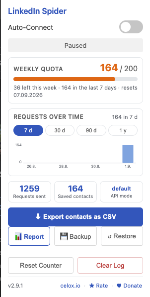

<p align="center">
  
</p>

<h1 align="center">LinkedIn Spider 🍻</h1>

<p align="center">
  <a href="README.md"></a>
  &nbsp;&nbsp;
  <a href="README_EN.md"></a>
</p>

<p align="center">
  
  
  
  
  
  
</p>

<p align="center">
  
  
  
  
  
  
</p>

<p align="center">
  
  
  
  
  
</p>

<p align="center">
  
  
  
  
  
  
</p>

<p align="center">
  <a href="https://www.paypal.com/donate/?business=martinpaush@gmail.com&currency_code=EUR"></a>
</p>

<p align="center">
  Chrome Extension (Manifest V3) zum automatischen Versenden von Kontaktanfragen auf LinkedIn-Suchergebnisseiten — <b>mit selbstheilender Erkennung gegen LinkedIns DOM- und API-Änderungen</b>.
</p>

## Funktionsweise

Die Extension scannt LinkedIn-Suchergebnisse nach "Vernetzen"-Buttons und sendet Kontaktanfragen direkt über die LinkedIn Voyager API. Schlägt die API fehl (aber kein Rate-Limit), wird automatisch ein Click-Fallback verwendet — der zugleich LinkedIns echten Request auslöst, aus dem sich die Extension selbst neu kalibriert.

**Technische Details:**
- Mehrstufige, sprachunabhängige Button-Erkennung: `aria-label`-Muster, sichtbarer Text (6 Sprachen) **und** `href`-Heuristik (`search-custom-invite`), plus Legacy-`data-view-name`-Strategie
- Robuste Profil-ID-Extraktion: `componentkey="SearchResults…"` **oder** jedes Attribut mit einer `urn:li:fsd_profile:`-ID
- API-Aufruf an `/voyager/api/voyagerRelationshipsDashMemberRelationships`
- Click-Fallback mit `realClick()` (volle Pointer-+Maus-Event-Sequenz) wenn die API fehlschlägt
- Rate-Limiting: 1 Anfrage alle 1,5 Sekunden
- Automatische 60s-Pause bei LinkedIn 429 Rate-Limit
- CSRF-Token aus `JSESSIONID`-Cookie (bei jedem Request frisch eingesetzt)
- Profil-ID-basiertes Tracking verhindert doppelte Verarbeitung nach DOM-Ersetzung

## 🧬 Self-Healing (NEU in 2.7.0)

LinkedIn ändert sein Frontend (CSS-Klassen, DOM-Struktur) und seine internen APIs ständig — der häufigste Grund, warum solche Tools über Nacht kaputtgehen. LinkedIn Spider wehrt sich auf **zwei Ebenen** dagegen:

1. **Robuste DOM-Erkennung** — überlebt umbenannte Hash-Klassen, umgebautes DOM und Sprachwechsel, weil sie über `aria-label`, Text *und* `href` erkennt statt über zerbrechliche CSS-Selektoren.
2. **API-Auto-Capture** — ein Interceptor im MAIN-World der Seite (`interceptor.js`) belauscht LinkedIns eigenen Invite-Request und lernt dessen aktuelle Form ("Recipe": URL, Header, Body). Künftige Anfragen werden über dieses gelernte Recipe verschickt.

**Die Selbstheilungs-Schleife:** Bricht der API-Pfad → greift der Klick-Fallback → LinkedIn feuert seinen eigenen Request → der Interceptor schneidet ihn mit → ab dann läuft der schnelle API-Weg automatisch wieder. Ein veraltetes Recipe wird bei Fehler verworfen und neu gelernt. Das gelernte Recipe wird in `chrome.storage` persistiert; das Popup zeigt den API-Modus (`default` bzw. `self-healed ✓`).

> **Grenze:** Die Extension kann keinen völlig unbekannten API-Vertrag erraten — sie braucht **einen** funktionierenden echten Klick, um neu zu lernen. Solange LinkedIns Klick-Pfad funktioniert (der bricht praktisch nie vollständig weg), heilt sich der API-Pfad daraus von selbst.

## Features

- 🧬 **Self-Healing** gegen DOM- und API-Änderungen (siehe oben)
- 🌐 **Mehrsprachig** — Erkennung in DE / EN / FR / IT / ES / NL / PT
- AN/AUS-Schalter über Popup
- Anfragen-Zähler (persistent in `chrome.storage`)
- API-Modus-Anzeige im Popup (`default` / `self-healed ✓`)
- Counter zurücksetzen
- 📊 **Wochenkontingent im Popup** — 200 freie Kontaktanfragen pro Woche, verbraucht/verbleibend mit Fortschrittsbalken (plus rollierender 7-Tage-Wert); steht auch im Seiten-Badge
- 📈 **Verlaufs-Chart** mit wählbarem Zeitraum (7 d / 30 d / 90 d / 1 Jahr) — im Popup und im HTML-Report
- 💾 **Backup & Wiederherstellung** — alle Werte als JSON sichern und zurückspielen
- 📇 **Kontaktprotokoll** — jede gesendete Anfrage wird dauerhaft gespeichert (Name, Datum, Profil-URL, Headline, Firma, Ort, Kontaktgrad, Profil-ID, Sendeweg, Suchseite)
- ⬇ **CSV-Export** aus dem Popup — Excel-fertig (Semikolon + UTF-8-BOM), Dateiname mit Datumsstempel als Vorschlag
- 📊 **HTML-Report-Export** — eigenständige Datei mit Chart, Kontingent und Kontakttabelle, ohne externe Assets
- 🔖 **Versionsnummer + Links im Footer** des Popups (SemVer)
- 🔁 **Duplikatsperre über Sessions** — wer einmal im Protokoll steht, wird nie erneut angefragt
- Visuelles Status-Badge (unten rechts auf der Seite)
- Erfolgreiche Vernetzungen werden mit 🍻-Emoji markiert — mit Material-3-Expressive-Physik-Animation (Fall mit Gravitation, Aufprall-Squash & abklingende Bounces) und Custom-Tooltip beim Hover
- Echtzeit-Statusanzeige im Badge
- Automatische Rate-Limit-Erkennung mit 60s Pause
- Click-Fallback erkennt "Ausstehend"-Statuswechsel als Erfolg
- DOM-Scan beim Laden (Debug-Output in Console)

## Installation

### Option 1: Download (empfohlen)

1. **[Neueste Version herunterladen](https://github.com/pepperonas/linkedin-spider/releases/latest)** — ZIP-Datei unter "Assets"
2. ZIP entpacken — es entsteht ein Ordner `linkedin-spider`
3. Chrome öffnen und `chrome://extensions` in die Adressleiste eingeben
4. **Entwicklermodus** aktivieren (Schalter oben rechts)
5. **"Entpackte Erweiterung laden"** klicken
6. Den entpackten `linkedin-spider`-Ordner auswählen
7. Die Extension erscheint in der Chrome-Toolbar

### Option 2: Repository klonen

```bash
git clone https://github.com/pepperonas/linkedin-spider.git
```

1. Chrome öffnen: `chrome://extensions`
2. "Entwicklermodus" aktivieren (oben rechts)
3. "Entpackte Erweiterung laden" klicken
4. Den geklonten Ordner auswählen

> **Hinweis:** Nach jedem Code-Update das Refresh-Icon auf der Extension-Karte klicken **und** den LinkedIn-Tab neu laden (F5) — sonst läuft der alte Content-Script mit ungültigem Kontext weiter.

## Verwendung

<p align="center">
  
</p>

<p align="center">
  <em>Das Popup im Betrieb. Oben das Wochenkontingent — 164 von 200 verbraucht, der Balken ist
  ab 80&nbsp;% orange. Darunter der Verlauf (die laufende Spalte ist heller gezeichnet), die drei
  Kennzahlen, die Exporte und der Footer mit Version und Links.</em>
</p>

1. LinkedIn-Personensuche öffnen (z.B. `https://www.linkedin.com/search/results/people/`)
2. Extension-Icon in der Chrome-Toolbar anklicken
3. Toggle auf AN schalten
4. Badge unten rechts zeigt Fortschritt in Echtzeit

**Wochenkontingent:**

LinkedIn gibt **200 Kontaktanfragen pro Woche** frei. Das Popup zeigt oben, wie viele davon in der laufenden Woche verbraucht sind, wie viele bleiben und wann das Kontingent zurückgesetzt wird. Der Balken färbt sich ab 80 % orange und bei 0 verbleibenden Anfragen rot.

- **Woche = Kalenderwoche ab Montag 00:00 Ortszeit.** Zusätzlich steht daneben der **rollierende 7-Tage-Wert** — LinkedIn drosselt über ein gleitendes Fenster, ein Sonntag-plus-Montag-Schub kann also anschlagen, während die Kalenderwoche noch harmlos aussieht.
- Gezählt wird eine separate Zeitstempel-Liste (`lcEvents`), **nicht** das Kontaktprotokoll: das ist dedupliziert, gedeckelt und löschbar und würde zu wenig melden. `Clear Log` löscht deshalb die Kontakte, **nicht** die Kontingent-Historie.
- Das Seiten-Badge trägt den Stand dauerhaft mit (`🕸️ ✅ #12 Name · 43/200 wk`), damit das Kontingent genau dann sichtbar ist, wenn Anfragen rausgehen.
- Beim ersten Start nach dem Update wird die Historie einmalig aus den Zeitstempeln des vorhandenen Protokolls befüllt.
- Die Extension **stoppt nicht** von selbst bei 200 — die Anzeige informiert, die Entscheidung bleibt beim Nutzer.

> **Warum „Anfragen gesendet" groesser sein kann als „Gespeicherte Kontakte":**
> Der Zaehler laeuft seit der ersten Installation, das Kontaktprotokoll erst seit **2.8.0**.
> Kontingent und Chart speisen sich aus dem Protokoll — sie koennen also nicht weiter
> zurueckreichen als bis zu dem Tag, an dem das Protokoll angelegt wurde. Im Screenshot
> oben sind das 1259 gesendete Anfragen gegenueber 164 protokollierten.

**Verlauf:**

Unter dem Kontingent liegt ein Balken-Chart der gesendeten Anfragen. Der Zeitraum ist über Chips wählbar und wird gemerkt (`chrome.storage`):

| Zeitraum | Auflösung | Spalten |
|----------|-----------|---------|
| 7 d | Tag | 7 |
| 30 d | Tag | 30 |
| 90 d | Woche (Mo–So) | 13 |
| 1 y | Monat | 12 |

Die laufende Spalte ist heller gezeichnet und im Tooltip als „in progress" markiert — sonst läse sich der noch unfertige Tag als Einbruch. Das Chart ist handgeschriebenes Inline-SVG: ein Chrome-Popup läuft unter `script-src 'self'`, eine CDN-Chart-Bibliothek ist dort gar nicht ladbar — und eine gebündelte wäre die einzige Laufzeit-Abhängigkeit der ganzen Extension.

**Kontakte exportieren:**

Jede erfolgreiche Anfrage landet im Protokoll (`Saved contacts` im Popup). **⬇ Export contacts as CSV** öffnet den Speichern-Dialog mit einem vorgeschlagenen Namen wie `linkedin-spider-anfragen-2026-08-30_1432.csv`.

| Spalte | Inhalt |
|--------|--------|
| Datum | Zeitpunkt der Anfrage, lokale Zeit (`30.08.2026 14:32`) |
| Name | Name aus der Trefferkarte bzw. dem `aria-label` |
| Profil-URL | `https://www.linkedin.com/in/<vanity>` |
| Headline | Positionszeile der Trefferkarte |
| Firma | Firmen-Link der Karte, sonst aus der Headline (`… bei/at/@ …`) |
| Ort | Ortszeile der Trefferkarte |
| Grad | Kontaktgrad (`1.` / `2.` / `3.`) |
| Profil-ID | LinkedIn-Member-URN-ID |
| Methode | `api` (direkter Voyager-Call) oder `click` (Fallback) |
| Suchseite | URL, auf der die Anfrage ausgelöst wurde |

Die Karten-Felder sind Best-Effort: Ändert LinkedIn sein DOM, bleibt die betroffene Spalte leer — der Versand läuft unverändert weiter. Der Export liest direkt aus `chrome.storage` und funktioniert deshalb auch, wenn das Popup über einem Nicht-LinkedIn-Tab geöffnet wird. **Clear Log** löscht das Protokoll (zwei Klicks) und hebt damit auch die Duplikatsperre auf.

**Report exportieren (mit Chart):**

**📊 Report** schreibt eine eigenständige HTML-Datei (`linkedin-spider-report-2026-09-01_1432.html`): Wochenkontingent, das Chart des **gerade gewählten** Zeitraums und die vollständige Kontakttabelle. Alles ist inline — kein Skript, kein CDN, keine Schriftart von außen; die Datei öffnet offline aus dem Dateisystem.

**Backup & Wiederherstellung:**

- **💾 Backup** schreibt alle gespeicherten Werte als JSON (`linkedin-spider-backup-2026-09-01_1432.json`): Kontaktprotokoll, Kontingent-Historie, Zähler, gewählter Zeitraum und das gelernte API-Recipe.
- **↺ Restore** liest so eine Datei zurück — in zwei Schritten: Datei wählen, dann bestätigt ein zweiter Klick das Überschreiben.
- **Der Import ist streng.** Fremde oder beschädigte Dateien werden **komplett** abgelehnt (Klartext-Fehler im Popup), es wird nichts geschrieben. Geprüft werden App-Kennung, Typ und Schema-Version; ein neueres Schema wird abgelehnt statt halb gelesen. Unbekannte Felder in Kontaktdatensätzen fallen weg, kaputte Zähler/Zeitstempel/Zeiträume werden auf gültige Werte gesetzt.
- **Sicherheit:** Session-Header (`csrf-token`, `cookie`, `authorization`) werden aus dem Recipe **entfernt**, bevor es in die Datei geht — ein Backup, das man weiterreicht, trägt kein Sitzungs-Token. Funktional geht nichts verloren: bei jedem Versand wird ohnehin ein frischer CSRF-Token eingesetzt.
- **Ein Restore startet nie den Versand.** `Auto-Connect` steht danach immer auf AUS, egal was in der Datei stand.

**Footer im Popup:**

Unten im Popup stehen die **Versionsnummer** (SemVer, direkt aus `manifest.json` gelesen — nie hart im Code) sowie Links zu [celox.io](https://celox.io), zur [Google-Maps-Bewertung](https://g.page/r/CXgdRV3QysvxEBM/review) und zur PayPal-Spende an `martin.pfeffer@celox.io`.

**Status-Badge:**
- "🕸️ ready" (grau) — Extension geladen, inaktiv
- "🕸️ Active (X sent)" (grün) — Läuft, X Anfragen versendet
- "🕸️ ⏳ Name..." (LinkedIn-Blau) — Anfrage wird gerade gesendet
- "🕸️ 🧬 Recipe learned" (violett) — API-Request erfolgreich gelernt (Self-Healing)
- "🕸️ ✅ #X Name · 43/200 wk" (dunkelgrün) — Erfolgreiche Anfrage; der Zusatz ist der Wochenstand
- "🕸️ ❌ Rate-Limit! 60s pause..." (rot) — LinkedIn 429, wartet automatisch
- "🕸️ ❌ No CSRF Token!" (rot) — API-Fehler
- "🕸️ ⚠️ Reload this page" (rot) — die Extension wurde aktualisiert, dieser Tab laeuft noch auf dem alten Content-Script. **Seite neu laden**, dann laeuft es weiter

## Architektur

Zwei Content-Script-Welten plus Popup:

| Datei | World | Rolle |
|-------|-------|-------|
| `interceptor.js` | **MAIN** (`document_start`) | Patcht `fetch`/`XMLHttpRequest`, schneidet LinkedIns Invite-Request mit, schickt das "Recipe" per `postMessage` |
| `lib.js` | ISOLATED | Reine, testbare Kernfunktionen: Selektoren, Recipe-Bau, Invite-Erkennung, Kontingent-/Chart-Mathematik, SVG-Chart, Backup-Format |
| `content.js` | ISOLATED | Orchestrierung: DOM-Scan, recipe-getriebene API-Calls, Click-Fallback, Recipe-Lernen, Badge, Kontingent-Historie |
| `popup.html` / `popup.js` | — | Popup-UI: Toggle, Kontingent, Chart, Counter, API-Modus, CSV-/HTML-/Backup-Export, Restore, Footer (lädt `lib.js` mit) |
| `styles.css` | — | Popup-Styling |
| `manifest.json` | — | Chrome Extension Manifest V3 |
| `icon.png` | — | Extension-Icon |

## Tests

```bash
npm install
npm test
```

**287 Unit- und Integrationstests** mit Vitest + jsdom (Zeitzone in `vitest.config.js` auf `Europe/Berlin` gepinnt — die Kontingent- und Chart-Rechnung ist kalenderlokal, und der Fehler, den naive Millisekunden-Arithmetik erzeugt, existiert nur dort, wo die Uhren wirklich springen):
- `test/lib.test.js` — Kernfunktionen, Self-Healing-Helfer (Recipe-Bau, Invite-Erkennung), Mehrsprachen-Erkennung
- `test/export.test.js` — Namensschälung, Kartenextraktion, CSV-Erzeugung (Quoting, Injection-Schutz, BOM), Dateiname, Protokoll-Deckel
- `test/content-log.test.js` — lädt `content.js` echt und fährt einen kompletten Tick: erfolgreicher Send landet mit Kartendaten im Protokoll, Duplikatsperre greift
- `test/popup-export.test.js` — lädt `popup.html` + `popup.js` echt: Export-Download, Abbruch-Verhalten, Zwei-Schritt-Löschen
- `test/content.test.js` — Integrationstests für Message-Handling und DOM-Interaktion
- `test/popup.test.js` — Popup-UI und Chrome-API-Tests
- `test/stats.test.js` — Kontingent-Rechnung (Kalenderwoche, rollierende 7 Tage, Kappung), Bucket-Bildung je Zeitraum, SVG-Chart (Skalierung, laufende Spalte, Escaping, Leerzustand)
- `test/backup.test.js` — Backup-Format, Secret-Stripping, strenge Import-Validierung (fremde/kaputte/zu neue Dateien)
- `test/popup-stats.test.js` — lädt `popup.html` + `popup.js` echt: Kontingent-Anzeige, Chart + Zeitraumwahl, HTML-Report, Backup-/Restore-Roundtrip, Footer-Links
- `test/report.test.js` — HTML-Report: Eigenständigkeit (kein Skript, kein externer Verweis), Escaping gescrapter Namen, Kontingent-/Zeitraum-Angaben, Leerzustand
- `test/styles.test.js` — Kontrast-Untergrenzen (4,5:1 bzw. 3:1) für Popup **und** Report-CSS, Layout-Vertrag der Knopfreihe, jede von `popup.js` gesuchte ID existiert im Markup
- `test/resilience.test.js` — Verhalten nach einem Extension-Reload (Badge-Hinweis, Timer abgeraeumt, `getStatus` meldet es) + Laufzeit-Deckel fuer den Backfill
- `test/version.test.js` — SemVer, Gleichstand `manifest.json` ↔ `package.json` ↔ README-Badge, Footer-Vertrag, **Doku-Integritaet** (kein toter Bildverweis, jedes Bild mit Alt-Text, beide READMEs listen genau die vorhandenen Test-Dateien)
- `test/release.test.js` — prüft, dass das Release-ZIP jede vom Manifest referenzierte Datei enthält

Einzelne Datei / einzelner Test:
```bash
npx vitest run test/lib.test.js
npx vitest run -t "buildInviteRequest"
```

## CI/CD

- **Tests** — Laufen automatisch bei Push auf `main` und bei Pull Requests
- **Release** — Bei Push eines `v*`-Tags werden Tests ausgeführt und ein GitHub Release mit ZIP erstellt

## Changelog

### 2.9.1 — Nach einem Update nicht mehr stumm

Nach einem Extension-Update laeuft im offenen LinkedIn-Tab noch das **alte**
Content-Script weiter. Sein Zugang zur Extension ist aber weg: jeder
`chrome.*`-Aufruf wirft `Extension context invalidated`. Bisher fiel der Lauf
dadurch **lautlos** aus — keine Anfragen, kein Protokoll, unveraendertes Badge,
und ein Popup, das den Tab nicht erreichte und trotzdem „Paused" anzeigte. Die
einzige Abhilfe ist ein Reload der Seite; genau das steht jetzt da.

- **Seiten-Badge**: `⚠️ Reload this page` (rot) statt eines eingefrorenen
  Zustands. Der Hinweis wird danach nicht mehr ueberschrieben — eine spaetere
  Erfolgsmeldung wuerde die einzige Zeile uebermalen, die erklaert, warum nichts
  mehr protokolliert wird
- Der Scan-Timer wird abgeraeumt, statt weiter ins Leere zu laufen
- `getStatus` meldet `contextGone`, damit das Popup Bescheid weiss
- **Popup**: Statuszeile sagt `⚠️ Reload the LinkedIn tab` (gemessen 6,26:1),
  drosselt die Abfrage von 1 s auf 5 s statt einen stummen Tab weiter zu
  bombardieren, und erholt sich von selbst, sobald der Tab wieder antwortet.
  Kontingent, Chart und alle Exporte laufen dabei weiter — sie kommen aus dem
  Speicher, nicht aus dem Tab
- Der Schalter behauptet nicht mehr, etwas gestartet zu haben, das niemand
  empfangen hat
- **Backfill entquadratisiert**: die einmalige Uebernahme der Historie aus dem
  Kontaktprotokoll sortierte die Reihe bei **jedem** Eintrag neu — gemessen
  619 ms bei 5000 Eintraegen, mit n² wachsend, synchron bei jedem Seitenaufbau.
  Jetzt ein Durchlauf und ein Sortiervorgang; ein Test deckelt die Laufzeit
- Suite 263 → 283 Tests; 13 neue Mutationsproben, alle gefangen. Zwei davon
  ueberlebten zunaechst und deckten auf, dass die Zusicherungen auch ohne die
  Korrektur erfuellt waren — nachgeschaerft. Eine davon fand einen echten
  Fehler in der Korrektur selbst: die Erfolgsmeldung ueberschrieb den Warnhinweis

### 2.9.0 — Kontingent, Verlauf, Backup

- **Wochenkontingent im Popup**: 200 freie Anfragen/Woche, verbraucht + verbleibend mit Fortschrittsbalken, Reset-Datum, Warnfarbe ab 80 % und bei 0. Zusätzlich der **rollierende 7-Tage-Wert**, weil LinkedIn über ein gleitendes Fenster drosselt
- Der Stand steht auch im **Seiten-Badge** — sichtbar genau dann, wenn Anfragen rausgehen
- Gezählt wird eine **eigene Zeitstempel-Liste** statt des Kontaktprotokolls (das ist dedupliziert, gedeckelt und löschbar und würde zu wenig melden); beim ersten Start nach dem Update wird sie einmalig aus dem vorhandenen Protokoll befüllt
- **Verlaufs-Chart** mit wählbarem Zeitraum (7 d / 30 d / 90 d / 1 Jahr), Auswahl wird gemerkt; handgeschriebenes Inline-SVG ohne Abhängigkeit (ein Popup läuft unter `script-src 'self'`). Die laufende Spalte ist als „in progress" markiert. Neu gezeichnet wird nur bei echter Änderung — der Sekunden-Poll würde sonst laufende Tooltips abreißen
- **HTML-Report-Export**: eigenständige Datei mit Chart, Kontingent und Kontakttabelle, komplett inline
- **Backup & Wiederherstellung** aller Werte als JSON. Der Import ist streng (App-Kennung, Typ, Schema; fremde/kaputte Dateien werden komplett abgelehnt, ohne etwas zu schreiben), Session-Header werden vor dem Schreiben aus dem Recipe entfernt, und ein Restore setzt `Auto-Connect` immer auf AUS
- **SemVer + Footer** im Popup: Version aus dem Manifest, Links zu celox.io, Google-Maps-Bewertung und PayPal-Spende
- `manifest.json` und `package.json` tragen ab jetzt dieselbe Version — ein Test hält das fest (sie waren fünf Releases auseinandergelaufen)
- **Popup kompaktiert**: Chrome deckelt Popups bei 600 px Höhe — mit den neuen Blöcken lag der Footer darunter. Die drei Kennzahlen stehen jetzt als Streifen nebeneinander, Report/Backup/Restore teilen sich eine Reihe. Gemessen 596–598 px je nach Zustand (die Hinweiszeile ist leer oder belegt); der Screenshot oben zeigt 597 px
- **Kontrast korrigiert**: der neu eingeführte Grauton lag bei 3,19:1 und damit unter der 4,5:1-Grenze; alle Textrollen messen jetzt 5,0–5,7:1. Ein Test hält die Untergrenze fest — für das Popup **und** für das Report-CSS
- Testsuite von 136 auf 263 Tests, alle neuen Zusicherungen mutationsgeprüft

### 2.8.0 — Kontaktprotokoll & CSV-Export

- Jede erfolgreich gesendete Anfrage wird in `chrome.storage.local` protokolliert (Name, Zeitstempel, Profil-URL, Headline, Firma, Ort, Kontaktgrad, Profil-ID, Sendeweg, Suchseite)
- **CSV-Export im Popup**: Semikolon-getrennt mit UTF-8-BOM (deutsches Excel öffnet die Datei direkt in Spalten), Dateiname mit Datumsstempel als Vorschlag im Speichern-Dialog
- Schutz gegen CSV-Formel-Injection — gescrapte Namen landen in einer Tabellenkalkulation
- **Duplikatsperre über Sessions**: bereits angefragte Profile werden nach einem Reload nicht erneut kontaktiert
- Neue Permission `downloads`
- **Release-ZIP repariert**: `interceptor.js` fehlte seit 2.7.0 in der Paketierung, obwohl das Manifest es als Content-Script deklariert — die ZIPs der Releases 2.7.0–2.7.4 sind dadurch unvollständig. Ein Test hält jetzt fest, dass das ZIP jede vom Manifest referenzierte Datei enthält
- Testsuite von 67 auf 136 Tests, alle neuen Zusicherungen mutationsgeprüft

### 2.7.4 — Vanity-Lookup: API-Weg ohne Overlay
- ✨ **NEU:** Karten ohne Profil-URN im DOM werden jetzt über den Profil-Link der Karte (`/in/<vanity>`) + einen Voyager-Lookup aufgelöst (`getVanityFromCard` + `resolveProfileIdByVanity`) — auch diese Karten gehen den direkten API-Weg. Der Klick-Fallback (und damit das Einladungs-Overlay, das sich auf manchen Seiten gar nicht öffnet) wird nur noch als letzte Reserve gebraucht
- 🛡️ Mehrdeutigkeits-Schutz: enthält der Container Links zu *verschiedenen* Profilen (= ganze Ergebnisliste), wird abgebrochen, statt die falsche Person einzuladen; aufgelöste IDs werden gecacht und gegen Doppel-Einladungen geprüft
- ✅ Testabdeckung von 63 auf 67 erhöht

### 2.7.3 — Pointer-Events & Anti-Blockade
- 🛠️ **FIX:** `realClick()` sendet jetzt eine volle Pointer-+Maus-Sequenz (`pointerdown`/`pointerup` + Koordinaten) — LinkedIns neue SDUI-(React-)Buttons reagieren nur auf Pointer-Events, reine MouseEvents wurden ignoriert (Klick-Fallback tat „nichts")
- 🛠️ **FIX:** Karten ohne Profil-ID, bei denen der Klick-Fallback wiederholt scheitert, werden nach 3 Versuchen übersprungen (`data-lc-fails`) — vorher blockierte eine einzige kaputte Karte den gesamten Lauf endlos
- 🛠️ **FIX:** Bestätigungs-Klick wird verifiziert (Dialog wirklich zu?) und bis zu 3× wiederholt; hängt der Dialog trotzdem, wird er nach 5 Ticks geschlossen, statt den Lauf zu stoppen
- ⏱️ Dialog-Wartefenster nach dem Klick von 3 s auf 6 s erhöht (träge Suchseiten)
- ✅ Testabdeckung von 60 auf 63 erhöht

### 2.7.2 — Bestätigungsdialog-Fix
- 🛠️ **FIX:** LinkedIn hat den Dialog-Wortlaut geändert („Ohne **Nachricht** senden" statt „Ohne **Notiz** senden") — Erkennung matcht jetzt beide Varianten per Regex in allen 7 Sprachen, verankert, sodass der Nachbar-Button („Nachricht senden") nie getroffen wird
- 🛠️ **FIX:** SDUI-Dialoge ohne `role="dialog"`/`.artdeco-modal` werden über einen dokumentweiten Fallback-Scan gefunden
- ✅ Testabdeckung von 56 auf 60 erhöht

### 2.7.1 — 🍻 Material 3 Expressive
- ✨ **NEU:** Animiertes 🍻-Erfolgs-Emoji im Material-3-Expressive-Stil — spatialer Spring mit Gravitations-Fall, Aufprall-Squash-&-Stretch, abklingenden Bounces (Overshoot/Settle) und Amber-Shockwave-Ring
- ✨ **NEU:** Custom-Tooltip beim Hover („🍻 Networking, bottled and served by LinkedIn Spider") mit Spring-Entrance, viewport-Klemmung und Auto-Flip; `position: fixed`, um LinkedIns Overflow-Clipping zu entgehen
- ♿ Voller `prefers-reduced-motion`-Guard + `role="img"`/`aria-label`

### 2.7.0 — Self-Healing
- 🧬 **NEU:** API-Auto-Capture via MAIN-World-Interceptor — lernt LinkedIns aktuellen Invite-Endpoint selbst
- 🛠️ **FIX:** Connect-Buttons wurden nach Linkedins SDUI-Umstellung nicht mehr gefunden (verschachtelte `<span>`-Hashes, kein `data-view-name` mehr) → Erkennung jetzt über `aria-label` / Text / `href`
- 🌐 **NEU:** Mehrsprachige Erkennung (DE/EN/FR/IT/ES/NL/PT) für Connect-Buttons und Bestätigungsdialog
- 🛠️ **FIX:** Profil-ID-Extraktion robuster — matcht jede `urn:li:fsd_profile:`-ID, nicht nur zwei feste Attribute
- ✨ Popup zeigt den API-Modus (`default` / `self-healed ✓`)
- ✅ Testabdeckung von 40 auf 56 erhöht

### 2.6.0
- Englische Sprachunterstützung, Badge-Meldungen auf Englisch

## Hinweise

- Funktioniert nur auf `*.linkedin.com`-Seiten
- `interceptor.js` läuft im MAIN-World bei `document_start`, `lib.js`/`content.js` im ISOLATED-World bei `document_idle`
- Bei Reload der LinkedIn-Seite bleibt der AN/AUS-Status erhalten
- Counter und gelerntes API-Recipe werden in `chrome.storage.local` gespeichert
- Bereits verarbeitete Profile werden per Set im Speicher getrackt (überlebt DOM-Ersetzung durch LinkedIn)
- Modals werden automatisch übersprungen (kein Versand bei Buttons in Dialogen)

## Sicherheit

CSRF-Token wird automatisch aus dem Session-Cookie extrahiert und bei jedem Request frisch eingesetzt (ein mitgeschnittenes Token könnte abgelaufen sein). API-Calls nutzen `credentials: 'include'` und senden den `csrf-token`-Header gemäß LinkedIn Voyager-Protokoll. Gelernte Recipes verbleiben lokal in `chrome.storage` und werden nicht nach außen übertragen.

## Entwickler

**Martin Pfeffer** — [celox.io](https://celox.io)

## Lizenz

MIT — siehe [LICENSE](LICENSE)
