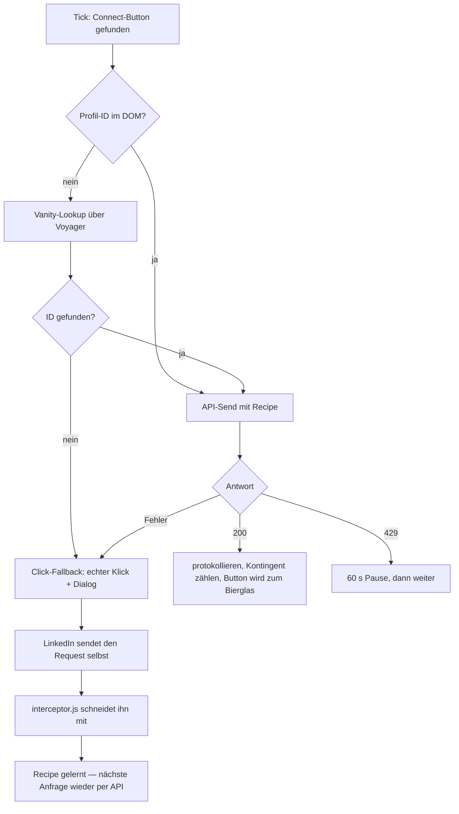
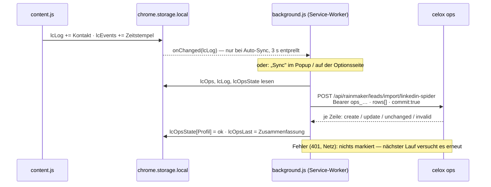

<p align="center">
  
</p>

<h1 align="center">LinkedIn Spider 🍻</h1>

<p align="center">
  <a href="README.md"></a>
  &nbsp;&nbsp;
  <a href="README_EN.md"></a>
</p>

<p align="center">
  
  
  
  
  
  
  
  
  
</p>

<p align="center">
  
  
  
  
  
  
  
  
  
  
  
</p>

<p align="center">
  
  
  
  
  
  
  
  
</p>

<p align="center">
  
  
  
  
  
  
  
  
  
  
  
</p>

<p align="center">
  <a href="https://www.paypal.com/donate/?business=martin.pfeffer@celox.io&currency_code=EUR&item_name=LinkedIn%20Spider"></a>
  &nbsp;
  <a href="https://g.page/r/CXgdRV3QysvxEBM/review"></a>
  &nbsp;
  <a href="https://celox.io"></a>
</p>

<p align="center">
  Chrome Extension (Manifest V3) zum automatischen Versenden von Kontaktanfragen auf LinkedIn-Suchergebnisseiten — <b>mit selbstheilender Erkennung gegen LinkedIns DOM- und API-Änderungen</b>, Wochenkontingent, Kontaktprotokoll, Exporten und Anbindung an <a href="https://ops.celox.io">celox ops</a>.
</p>

## Inhalt

<!-- toc -->
- [Auf einen Blick](#auf-einen-blick)
- [Funktionsweise](#funktionsweise)
- [Features](#features)
- [Installation](#installation)
- [Verwendung](#verwendung)
- [Berechtigungen und Daten](#berechtigungen-und-daten)
- [Architektur](#architektur)
- [Tests](#tests)
- [Entwicklung](#entwicklung)
- [Problembehebung](#problembehebung)
- [Changelog](#changelog)
- [Hinweise](#hinweise)
- [Rechtliches](#rechtliches)
- [Sicherheit](#sicherheit)
- [Entwickler](#entwickler)
- [Lizenz](#lizenz)
<!-- /toc -->

## Auf einen Blick

1. **[Neueste Version laden](https://github.com/pepperonas/linkedin-spider/releases/latest)**, entpacken, in `chrome://extensions` als entpackte Erweiterung laden (Entwicklermodus).
2. LinkedIn-Personensuche öffnen, Extension-Icon anklicken, **Auto-Connect** einschalten.
3. Das Badge unten rechts zeigt den Fortschritt — und immer den Stand des Wochenkontingents (`43/200 wk`).
4. Kontakte als **CSV** exportieren oder direkt nach **celox ops** übertragen (Popup ⚙ → Token).

> **Wichtig nach jedem Update:** Extension-Karte in `chrome://extensions` aktualisieren **und** den offenen LinkedIn-Tab neu laden. Seit 2.9.1 sagt es die Extension selbst (`⚠️ Reload this page`), wenn Sie das vergessen — vorher fiel sie lautlos aus.

## Funktionsweise

Die Extension scannt LinkedIn-Suchergebnisse nach „Vernetzen"-Buttons und sendet Kontaktanfragen direkt über die LinkedIn Voyager API. Schlägt die API fehl (aber kein Rate-Limit), wird automatisch ein Click-Fallback verwendet — der zugleich LinkedIns echten Request auslöst, aus dem sich die Extension selbst neu kalibriert.

**Technische Details:**

- Direkte API-Calls an LinkedIns interne Voyager-API (`verifyQuotaAndCreateV2`) mit CSRF-Token aus dem Session-Cookie
- 1,5-Sekunden-Intervall zwischen Anfragen (Rate-Limiting)
- Automatische 60-Sekunden-Pause bei HTTP 429 (LinkedIn Rate-Limit)
- Profil-Erkennung über `componentkey` / `data-chameleon-result-urn` (URN-basiert); ohne URN im DOM über den `/in/<vanity>`-Link der Karte plus Voyager-Lookup
- Sprachunabhängige Erkennung von Connect-Buttons über `aria-label`, Text oder `href` (DE / EN / FR / IT / ES / NL / PT)
- Bestätigungsdialog („Ohne Notiz/Nachricht senden") wird automatisch bedient, in beiden Wortlaut-Varianten

### Self-Healing

LinkedIn ändert DOM und API häufig. Die Extension begegnet dem an zwei Fronten:

1. **Heuristische DOM-Erkennung** — aria-label, Text und `href` statt fester CSS-Klassen. Fällt eine Signalquelle weg, tragen die anderen.
2. **Lernender API-Interceptor** — `interceptor.js` läuft in der MAIN-World der Seite und schneidet LinkedIns *eigenen* Invite-Request mit (URL, Header, Body). Dieses „Recipe" wird gespeichert und für alle weiteren Anfragen wiederverwendet. Ändert LinkedIn den Endpunkt oder das Payload-Format, genügt **ein** echter Klick, und die Extension arbeitet wieder auf dem schnellen API-Weg.



Die Selbstheilungs-Schleife: Bricht der API-Pfad → greift der Klick-Fallback → LinkedIn feuert seinen eigenen Request → der Interceptor schneidet ihn mit → ab dann läuft der schnelle API-Weg automatisch wieder. Ein veraltetes Recipe wird bei Fehler verworfen und neu gelernt. Das gelernte Recipe wird in `chrome.storage` persistiert; das Popup zeigt den API-Modus (`default` bzw. `self-healed ✓`).

## Features

- **Self-Healing** gegen DOM- und API-Änderungen (siehe oben)
- **Mehrsprachig** — Erkennung in DE / EN / FR / IT / ES / NL / PT
- AN/AUS-Schalter über Popup, Anfragen-Zähler (persistent), API-Modus-Anzeige (`default` / `self-healed ✓`)
- **Wochenkontingent im Popup** — 200 freie Kontaktanfragen pro Woche, verbraucht/verbleibend mit Fortschrittsbalken (plus rollierender 7-Tage-Wert); steht auch im Seiten-Badge
- **Verlaufs-Chart** mit wählbarem Zeitraum (7 d / 30 d / 90 d / 1 Jahr) — im Popup und im HTML-Report
- **Kontaktprotokoll** — jede gesendete Anfrage wird dauerhaft gespeichert (Name, Datum, Profil-URL, Headline, Firma, Ort, Kontaktgrad, Profil-ID, Sendeweg, Suchseite)
- **CSV-Export** — Excel-fertig (Semikolon + UTF-8-BOM), Dateiname mit Datumsstempel
- **HTML-Report-Export** — eigenständige Datei mit Chart, Kontingent und Kontakttabelle, ohne externe Assets
- **Backup & Wiederherstellung** — alle Werte als JSON sichern und zurückspielen; strenger Import
- **celox-ops-Anbindung** — gesendete Anfragen als Rainmaker-Leads (Status „angeschrieben"), per CSV-Import in ops oder als Push aus der Extension (Service-Worker, optional automatisch)
- **Duplikatsperre über Sessions** — wer einmal im Protokoll steht, wird nie erneut angefragt
- Visuelles Status-Badge unten rechts auf der Seite, mit Klartext-Hinweis nach einem Extension-Update
- Erfolgreiche Vernetzungen werden mit 🍻-Emoji markiert — Material-3-Expressive-Physik-Animation (Fall mit Gravitation, Aufprall-Squash, abklingende Bounces) und Custom-Tooltip
- Automatische Rate-Limit-Erkennung mit 60-s-Pause; Click-Fallback erkennt „Ausstehend"-Statuswechsel als Erfolg
- **Versionsnummer + Links im Footer** des Popups (SemVer)

## Installation

### Option 1: Download (empfohlen)

1. **[Neueste Version herunterladen](https://github.com/pepperonas/linkedin-spider/releases/latest)** — ZIP-Datei unter „Assets"
2. ZIP entpacken — es entsteht ein Ordner `linkedin-spider`
3. Chrome öffnen und `chrome://extensions` in die Adressleiste eingeben
4. **Entwicklermodus** aktivieren (Schalter oben rechts)
5. **„Entpackte Erweiterung laden"** klicken
6. Den entpackten `linkedin-spider`-Ordner auswählen
7. Die Extension erscheint in der Chrome-Toolbar

### Option 2: Repository klonen

```bash
git clone https://github.com/pepperonas/linkedin-spider.git
```

1. Chrome öffnen: `chrome://extensions`
2. „Entwicklermodus" aktivieren (oben rechts)
3. „Entpackte Erweiterung laden" klicken
4. Den geklonten Ordner auswählen

> **Hinweis:** Nach jedem Code-Update das Refresh-Icon auf der Extension-Karte klicken **und** den LinkedIn-Tab neu laden (F5) — sonst läuft das alte Content-Script mit ungültigem Kontext weiter (die Extension zeigt dann `⚠️ Reload this page`).

### Kompatibilität

| | |
|---|---|
| Browser | **Chrome 102** oder neuer (`minimum_chrome_version` im Manifest — ältere Versionen verweigern die Installation, statt später an `optional_host_permissions` zu scheitern) |
| Andere Chromium-Browser (Edge, Brave, Vivaldi) | technisch kompatibel, **nicht getestet** |
| Firefox / Safari | nicht unterstützt (MV3-Service-Worker + `chrome.*`-API) |
| LinkedIn-Sprache | DE, EN, FR, IT, ES, NL, PT |
| Verteilung | GitHub-Release-ZIP, **kein** Chrome-Web-Store-Eintrag — Sideload-Installationen aktualisieren sich nicht von selbst |

## Verwendung

<p align="center">
  
</p>

<p align="center">
  <em>Das Popup im Betrieb. Oben das Wochenkontingent — 164 von 200 verbraucht, der Balken ist
  ab 80&nbsp;% orange. Darunter der Verlauf (die laufende Spalte ist heller gezeichnet), die drei
  Kennzahlen, die Exporte und der Footer mit Version und Links.</em>
</p>

1. LinkedIn-Personensuche öffnen (z.B. `https://www.linkedin.com/search/results/people/`)
2. Extension-Icon in der Chrome-Toolbar anklicken
3. Toggle auf AN schalten
4. Badge unten rechts zeigt Fortschritt in Echtzeit

**Wochenkontingent:**

LinkedIn gibt **200 Kontaktanfragen pro Woche** frei. Das Popup zeigt oben, wie viele davon in der laufenden Woche verbraucht sind, wie viele bleiben und wann das Kontingent zurückgesetzt wird. Der Balken färbt sich ab 80 % orange und bei 0 verbleibenden Anfragen rot.

- **Woche = Kalenderwoche ab Montag 00:00 Ortszeit.** Zusätzlich steht daneben der **rollierende 7-Tage-Wert** — LinkedIn drosselt über ein gleitendes Fenster, ein Sonntag-plus-Montag-Schub kann also anschlagen, während die Kalenderwoche noch harmlos aussieht.
- Gezählt wird eine separate Zeitstempel-Liste (`lcEvents`), **nicht** das Kontaktprotokoll: das ist dedupliziert, gedeckelt und löschbar und würde zu wenig melden. `Clear Log` löscht deshalb die Kontakte, **nicht** die Kontingent-Historie.
- Das Seiten-Badge trägt den Stand dauerhaft mit (`🕸️ ✅ #12 Name · 43/200 wk`), damit das Kontingent genau dann sichtbar ist, wenn Anfragen rausgehen.
- Beim ersten Start nach dem Update wird die Historie einmalig aus den Zeitstempeln des vorhandenen Protokolls befüllt.
- Die Extension **stoppt nicht** von selbst bei 200 — die Anzeige informiert, die Entscheidung bleibt beim Nutzer.

> **Warum „Anfragen gesendet" groesser sein kann als „Gespeicherte Kontakte":**
> Der Zaehler laeuft seit der ersten Installation, das Kontaktprotokoll erst seit **2.8.0**.
> Kontingent und Chart speisen sich aus dem Protokoll — sie koennen also nicht weiter
> zurueckreichen als bis zu dem Tag, an dem das Protokoll angelegt wurde. Im Screenshot
> oben sind das 1259 gesendete Anfragen gegenueber 164 protokollierten.

**Verlauf:**

Unter dem Kontingent liegt ein Balken-Chart der gesendeten Anfragen. Der Zeitraum ist über Chips wählbar und wird gemerkt (`chrome.storage`):

| Zeitraum | Auflösung | Spalten |
|----------|-----------|---------|
| 7 d | Tag | 7 |
| 30 d | Tag | 30 |
| 90 d | Woche (Mo–So) | 13 |
| 1 y | Monat | 12 |

Die laufende Spalte ist heller gezeichnet und im Tooltip als „in progress" markiert — sonst läse sich der noch unfertige Tag als Einbruch. Das Chart ist handgeschriebenes Inline-SVG: ein Chrome-Popup läuft unter `script-src 'self'`, eine CDN-Chart-Bibliothek ist dort gar nicht ladbar — und eine gebündelte wäre die einzige Laufzeit-Abhängigkeit der ganzen Extension.

**Kontakte exportieren:**

Jede erfolgreiche Anfrage landet im Protokoll (`Saved contacts` im Popup). **⬇ Export contacts as CSV** öffnet den Speichern-Dialog mit einem vorgeschlagenen Namen wie `linkedin-spider-anfragen-2026-08-30_1432.csv`.

| Spalte | Inhalt |
|--------|--------|
| Datum | Zeitpunkt der Anfrage, lokale Zeit (`30.08.2026 14:32`) |
| Name | Name aus der Trefferkarte bzw. dem `aria-label` |
| Profil-URL | `https://www.linkedin.com/in/<vanity>` |
| Headline | Positionszeile der Trefferkarte |
| Firma | Firmen-Link der Karte, sonst aus der Headline (`… bei/at/@ …`) |
| Ort | Ortszeile der Trefferkarte |
| Grad | Kontaktgrad (`1.` / `2.` / `3.`) |
| Profil-ID | LinkedIn-Member-URN-ID |
| Methode | `api` (direkter Voyager-Call) oder `click` (Fallback) |
| Suchseite | URL, auf der die Anfrage ausgelöst wurde |

Die Karten-Felder sind Best-Effort: Ändert LinkedIn sein DOM, bleibt die betroffene Spalte leer — der Versand läuft unverändert weiter. Der Export liest direkt aus `chrome.storage` und funktioniert deshalb auch, wenn das Popup über einem Nicht-LinkedIn-Tab geöffnet wird. **Clear Log** löscht das Protokoll (zwei Klicks) und hebt damit auch die Duplikatsperre auf.

**Report exportieren (mit Chart):**

**📊 Report** schreibt eine eigenständige HTML-Datei (`linkedin-spider-report-2026-09-01_1432.html`): Wochenkontingent, das Chart des **gerade gewählten** Zeitraums und die vollständige Kontakttabelle. Alles ist inline — kein Skript, kein CDN, keine Schriftart von außen; die Datei öffnet offline aus dem Dateisystem.

**Backup & Wiederherstellung:**

- **💾 Backup** schreibt alle gespeicherten Werte als JSON (`linkedin-spider-backup-2026-09-01_1432.json`): Kontaktprotokoll, Kontingent-Historie, Zähler, gewählter Zeitraum und das gelernte API-Recipe.
- **↺ Restore** liest so eine Datei zurück — in zwei Schritten: Datei wählen, dann bestätigt ein zweiter Klick das Überschreiben.
- **Der Import ist streng.** Fremde oder beschädigte Dateien werden **komplett** abgelehnt (Klartext-Fehler im Popup), es wird nichts geschrieben. Geprüft werden App-Kennung, Typ und Schema-Version; ein neueres Schema wird abgelehnt statt halb gelesen. Unbekannte Felder in Kontaktdatensätzen fallen weg, kaputte Zähler/Zeitstempel/Zeiträume werden auf gültige Werte gesetzt.
- **Sicherheit:** Session-Header (`csrf-token`, `cookie`, `authorization`) werden aus dem Recipe **entfernt**, bevor es in die Datei geht — ein Backup, das man weiterreicht, trägt kein Sitzungs-Token. Funktional geht nichts verloren: bei jedem Versand wird ohnehin ein frischer CSRF-Token eingesetzt.
- **Ein Restore startet nie den Versand.** `Auto-Connect` steht danach immer auf AUS, egal was in der Datei stand.

**Leads nach celox ops übertragen (ab 2.10.0):**

Jede gesendete Kontaktanfrage kann als Lead in [celox ops](https://ops.celox.io) landen — als
`RainmakerLead` mit Status **„angeschrieben"** und Quelle `linkedin-spider`. ops erkennt Personen,
die schon in der Pipeline stehen, an der Profil-URL und **ergänzt nur, was fehlt** — nichts wird
überschrieben, niemand zurückgestuft. Ein doppelter Import ist auf Datenbankseite unmöglich.

Zwei Wege, dieselbe Abbildung:

| Weg | Wo | Wann sinnvoll |
|-----|-----|---------------|
| **CSV-Import** | ops → Pipeline → **„Spider-CSV"** | Der Export von oben, mit Vorschau (neu / ergänzt / bereits vorhanden) vor der Übernahme. Kein Token nötig. |
| **Push aus der Extension** | Popup-Zeile `ops: … pending` → **Sync**, oder automatisch nach jedem Versand | Läuft im Service-Worker, überlebt also das Schließen des Popups. |



Einrichtung für den Push: in ops unter **Einstellungen → „API-Token für LinkedIn Spider"** einen
Token erzeugen (wird genau einmal angezeigt), dann im Popup auf ⚙ → Token eintragen → **Test
connection** → **Save**. Optional **„Sync automatically"** einschalten.

- Der Token kann in ops **ausschließlich Leads importieren** — nichts lesen, nichts löschen. Er wird
  nur im Browserprofil gespeichert und geht an keinen anderen Dienst.
- Der Sync-Stand liegt in einem eigenen Speicherschlüssel (`lcOpsState`), getrennt vom Protokoll:
  der Worker schreibt nie in `lcLog`, während das Content-Script dort anhängt.
- Fehlgeschlagene Übertragungen (Netz weg, Token widerrufen) bleiben ausstehend und werden beim
  nächsten Sync erneut versucht; die Fehlermeldung steht in der Popup-Zeile. Was ops als ungültig
  ablehnt (keine LinkedIn-Profil-URL), wird nicht ewig wiederholt.
- **Was die Extension nicht behaupten kann:** die Annahme einer Anfrage. Sie sieht nur den Versand;
  `connected` setzt man in ops von Hand.

**Footer im Popup:**

Unten im Popup stehen die **Versionsnummer** (SemVer, direkt aus `manifest.json` gelesen — nie hart im Code) sowie Links zu [celox.io](https://celox.io), zur [Google-Maps-Bewertung](https://g.page/r/CXgdRV3QysvxEBM/review) und zur PayPal-Spende an `martin.pfeffer@celox.io`.

**Status-Badge:**
- "🕸️ ready" (grau) — Extension geladen, inaktiv
- "🕸️ Active (X sent)" (grün) — Läuft, X Anfragen versendet
- "🕸️ ⏳ Name..." (LinkedIn-Blau) — Anfrage wird gerade gesendet
- "🕸️ 🧬 Recipe learned" (violett) — API-Request erfolgreich gelernt (Self-Healing)
- "🕸️ ✅ #X Name · 43/200 wk" (dunkelgrün) — Erfolgreiche Anfrage; der Zusatz ist der Wochenstand
- "🕸️ ❌ Rate-Limit! 60s pause..." (rot) — LinkedIn 429, wartet automatisch
- "🕸️ ❌ No CSRF Token!" (rot) — API-Fehler
- "🕸️ ⚠️ Reload this page" (rot) — die Extension wurde aktualisiert, dieser Tab laeuft noch auf dem alten Content-Script. **Seite neu laden**, dann laeuft es weiter

## Berechtigungen und Daten

### Berechtigungen

Die Extension fragt genau das an, was sie braucht — und die Tabelle sagt, wofür:

| Berechtigung | Wofür |
|---|---|
| `activeTab` | Das Popup spricht mit dem gerade aktiven LinkedIn-Tab (Statusabfrage, AN/AUS). |
| `storage` | Zähler, Protokoll, Kontingent-Historie, gelerntes Recipe, ops-Einstellungen — alles in `chrome.storage.local`. |
| `downloads` | CSV, HTML-Report und Backup werden über die Downloads-API mit Speichern-Dialog und vorgeschlagenem Dateinamen geschrieben. |
| `https://ops.celox.io/*` (`host_permissions`) | Der Service-Worker darf Leads an celox ops senden — nur an diesen Host. |
| `https://*/*`, `http://localhost/*`, `http://127.0.0.1/*` (`optional_host_permissions`) | **Nicht** von Haus aus erteilt. Wird nur angefragt, wenn Sie auf der Optionsseite eine **eigene** ops-Adresse speichern (Chrome zeigt dann einen Dialog). `localhost` erlaubt eine Entwicklungsinstanz. |
| `*://*.linkedin.com/*` (Content-Scripts) | `interceptor.js`, `lib.js` und `content.js` laufen nur auf LinkedIn-Seiten. |

### Was gespeichert wird

Alles liegt in `chrome.storage.local` — also im Chrome-Profil auf Ihrem Rechner, nicht in der Cloud, nicht in `chrome.storage.sync`.

| Schlüssel | Inhalt | Gelöscht durch |
|---|---|---|
| `lcEnabled` | AN/AUS-Zustand des Schalters | — |
| `lcCount` | Zähler „Requests sent" (läuft seit der ersten Installation) | Reset Counter |
| `lcLog` | Kontaktprotokoll (max. 5000 Einträge, FIFO), Grundlage für Exporte und Duplikatsperre | Clear Log |
| `lcEvents` | Zeitstempel jeder gesendeten Anfrage (max. 400 Tage / 20 000), Grundlage für Kontingent und Chart — **bleibt bei Clear Log erhalten**, sonst wäre das Kontingent falsch | Backup-Restore |
| `lcRecipe` | Das gelernte Invite-Recipe (Self-Healing) | wird bei Fehlschlag automatisch verworfen |
| `lcRange` | Gewählter Chart-Zeitraum | — |
| `lcOps` | ops-Adresse, API-Token, Auto-Sync-Schalter | Optionsseite |
| `lcOpsState` | Je Kontakt: von ops bestätigt / ungültig / Fehler (getrennt von `lcLog`, damit Worker und Content-Script nie dieselbe Liste schreiben) | „Forget sync state" |
| `lcOpsLast` | Zusammenfassung des letzten Sync-Laufs | „Forget sync state" |
| `lcSeen` | Dauerhafte Merkliste der angefragten Profil-IDs (max. 100 000, ~20 Byte je Eintrag) — die Duplikatsperre über die FIFO-Grenze des Protokolls hinaus; beim ersten Start nach 2.11.0 einmalig aus dem Protokoll befüllt | Clear Log |
| `lcHalt` | Grund und Zeitpunkt, wenn der Notstopp (5 Fehlschläge in Folge) den Lauf angehalten hat | erneutes Einschalten |
| `lcLastApiError` | Letzte Ablehnung durch LinkedIn (Status, erste 300 Zeichen der Antwort) — zur Diagnose auf der Optionsseite | — |
| `lcUpdate` | Ergebnis des letzten Update-Checks (nur nach Ihrem Klick, höchstens täglich) | — |

### Was den Browser verlässt

- **An LinkedIn:** die Kontaktanfragen selbst (Voyager API) und der Vanity-Lookup — nichts anderes.
- **An celox ops:** **nur wenn Sie einen Token hinterlegt haben.** Dann die Felder des Kontaktprotokolls (Name, Profil-URL, Headline, Firma, Ort, Kontaktgrad, Profil-ID, Sendeweg, Suchseite, Zeitpunkt) an den Host aus `lcOps.baseUrl`. Der Token berechtigt in ops ausschließlich zum Import.
- **An niemanden sonst.** Keine Telemetrie, keine Analytics, kein Update-Check, keine externen Assets in den Exporten.
- Das Backup-JSON entfernt Session-Header (`csrf-token`, `cookie`, `authorization`) aus dem gespeicherten Recipe, bevor es die Datei schreibt.

## Architektur

Zwei Content-Script-Welten, ein Service-Worker, zwei Oberflächen:

| Datei | World | Rolle |
|-------|-------|-------|
| `interceptor.js` | **MAIN** (`document_start`) | Patcht `fetch`/`XMLHttpRequest`, schneidet LinkedIns Invite-Request mit, schickt das „Recipe" per `postMessage` |
| `lib.js` | ISOLATED | Reine, testbare Kernfunktionen: Selektoren, Recipe-Bau, Invite-Erkennung, Kontingent-/Chart-Mathematik, SVG-Chart, Backup-Format, ops-Sync-Kern |
| `content.js` | ISOLATED | Orchestrierung: DOM-Scan, recipe-getriebene API-Calls, Click-Fallback, Recipe-Lernen, Badge, Kontingent-Historie |
| `background.js` | Service-Worker | ops-Sync: reagiert auf `opsSync`/`opsTest`-Nachrichten und (bei Auto-Sync) auf neue Protokoll-Einträge; die Logik selbst ist `lib.js::opsSyncRun` mit injiziertem `fetch` |
| `popup.html` / `popup.js` | — | Popup-UI: Toggle, Kontingent, Chart, Counter, API-Modus, ops-Zeile, CSV-/HTML-/Backup-Export, Restore, Footer (lädt `lib.js` mit) |
| `options.html` / `options.js` / `options.css` | — | Optionsseite: ops-URL, API-Token, Auto-Sync, Verbindungstest, Sync-Stand, „Forget sync state" |
| `styles.css` | — | Popup-Styling |
| `manifest.json` | — | Chrome Extension Manifest V3 |
| `icon.png` | — | Extension-Icon |

`lib.js` wird von **allen** Oberflächen geladen (Content-Script, Popup, Optionsseite, Service-Worker per `importScripts`) und ist zugleich das Ziel der Unit-Tests — dieselbe Datei, kein Nachbau.

### Nachrichten-Protokoll

| Aktion | Richtung | Payload | Antwort |
|---|---|---|---|
| `toggle` | Popup → Content-Script | `{ enabled }` | `{ ok }` |
| `getStatus` | Popup → Content-Script | — | `{ active, count, healed, contextGone }` |
| `resetCount` · `clearLog` · `reloadState` | Popup → Content-Script | — | `{ ok }` |
| `opsSync` | Popup/Optionen → **Service-Worker** | — | `{ ok, summary, error }` |
| `opsTest` | Optionen → **Service-Worker** | `{ settings: { baseUrl, token } }` | `{ ok, status?, error? }` |
| `invite-captured` | `interceptor.js` → Content-Script (`window.postMessage`, nur eigene Origin) | `{ recipe }` | — |

Antwortet der Tab nicht (kein Content-Script, oder nach einem Extension-Update), zeigt das Popup `⚠️ Reload the LinkedIn tab` statt „Paused" und drosselt seine Abfrage von 1 s auf 5 s.

## Tests

```bash
npm install
npm test            # einmal
npx vitest          # Watch-Modus
npx vitest run test/lib.test.js          # eine Datei
npx vitest run -t "buildInviteRequest"    # ein Test
```

**439 Unit- und Integrationstests** mit Vitest + jsdom (Zeitzone in `vitest.config.js` auf `Europe/Berlin` gepinnt — die Kontingent- und Chart-Rechnung ist kalenderlokal, und der Fehler, den naive Millisekunden-Arithmetik erzeugt, existiert nur dort, wo die Uhren wirklich springen):

| Datei | Prüft |
|---|---|
| `test/lib.test.js` | Kernfunktionen, Self-Healing-Helfer (Recipe-Bau, Invite-Erkennung), Mehrsprachen-Erkennung |
| `test/interceptor.test.js` | **lädt `interceptor.js` echt** in jsdom: mitgeschnittener `fetch`/XHR-Invite wird als Recipe gepostet, Fremdes nicht, nur POST, nur eigene Origin — und Paritätstest der Heuristik gegen `lib.js` (die Datei trägt sie doppelt, weil die MAIN-World `window.LC` nicht sieht) |
| `test/export.test.js` | Namensschälung, Kartenextraktion, CSV-Erzeugung (Quoting, Injection-Schutz, BOM), Dateiname, Protokoll-Deckel |
| `test/stats.test.js` | Kontingent-Rechnung (Kalenderwoche, rollierende 7 Tage, Kappung), Bucket-Bildung je Zeitraum, DST-Nächte, SVG-Chart (Skalierung, laufende Spalte, Escaping, Leerzustand) |
| `test/backup.test.js` | Backup-Format, Secret-Stripping, strenge Import-Validierung (fremde/kaputte/zu neue Dateien) |
| `test/report.test.js` | HTML-Report: Eigenständigkeit (kein Skript, kein externer Verweis), Escaping gescrapter Namen, Kontingent-/Zeitraum-Angaben, Leerzustand |
| `test/ops-sync.test.js` | Sync-Kern (`opsSyncRun` mit injiziertem `fetch`): Bearer-Token, Stapel, Zuordnung per Antwort-Index, 401/Netzfehler lassen den Stand unberührt, „ungültig" wird nicht ewig wiederholt |
| `test/content-log.test.js` | lädt `content.js` echt und fährt einen kompletten Tick: erfolgreicher Send landet mit Kartendaten im Protokoll, Zeitstempel für das Kontingent, Duplikatsperre greift, Backfill nur einmal |
| `test/resilience.test.js` | Verhalten nach einem Extension-Reload (Badge-Hinweis, Timer abgeräumt, `getStatus` meldet es) + Laufzeit-Deckel für den Backfill |
| `test/guard.test.js` | Merkliste (`addSeen`/`seenIds`, Deckel), „Ausstehend"-Texte in 7 Sprachen, `isSearchPage`, Versionsvergleich, Release-Payload-Prüfung, Tages-Rhythmus des Update-Checks, `lcSeen` im Backup |
| `test/content-guard.test.js` | lädt `content.js` echt: `lcSeen` wird geschrieben/gelesen/einmalig befüllt und mit Clear Log geleert, Klick-Erfolg in ES/IT/FR/PT/NL, Notstopp nach 5 Fehlschlägen (nicht die ganze Seite), Erfolg setzt die Strähne zurück, Badge nur auf Suchseiten oder im Lauf |
| `test/background.test.js` | lädt `background.js` echt: Sync auf Nachricht, Auto-Sync mit Entprellung, kein paralleler Lauf, `lcLog` wird nie angefasst |
| `test/popup-export.test.js` | lädt `popup.html` + `popup.js` echt: Export-Download, Abbruch-Verhalten, Zwei-Schritt-Löschen |
| `test/popup-stats.test.js` | lädt `popup.html` + `popup.js` echt: Kontingent-Anzeige, Chart + Zeitraumwahl, HTML-Report, Backup-/Restore-Roundtrip, unerreichbarer Tab, ops-Zeile, Footer-Links |
| `test/options.test.js` | lädt `options.html` + `options.js` echt: Validierung, Host-Berechtigung, Verbindungstest, Sync-Stand, zweistufiges Vergessen |
| `test/styles.test.js` | Kontrast-Untergrenzen (4,5:1 bzw. 3:1) für Popup, Optionsseite **und** Report-CSS, Layout-Vertrag der Knopfreihe, jede von `popup.js` gesuchte ID existiert im Markup |
| `test/docs.test.js` | Doku-Wächter: Inhaltsverzeichnis ↔ Überschriften, DE/EN-Parität (Abschnitte, Diagramme, Bilder, Badge-Zahl), jeder Speicherschlüssel und jede Berechtigung dokumentiert, Mindest-Chrome-Version, keine toten Links, Badges gegen Konstanten geprüft |
| `test/version.test.js` | SemVer, Gleichstand `manifest.json` ↔ `package.json` ↔ README-Badge, Footer-Vertrag, Doku-Integrität (Bildverweise, Alt-Texte, Testliste) |
| `test/release.test.js` | prüft, dass das Release-ZIP **jeden** Manifest-Einstieg enthält — Content-Scripts, Popup, Service-Worker samt `importScripts`, Optionsseite samt ihrer Assets |
| `test/content.test.js` · `test/popup.test.js` | ältere Simulations-Tests für Message-Handling und Popup-UI |

### Testkonventionen

- **Echte Dateien laden, nicht nachbauen.** `content.js`, `background.js`, `interceptor.js`, `popup.html`+`popup.js`, `options.html`+`options.js` werden in jsdom ausgeführt (Chrome-API und `fetch` gestubbt, Timer gefälscht). Ein Test, der die Logik nur nachahmt, kann grün bleiben, während die ausgelieferte Datei kaputt ist.
- **Jede neue Zusicherung wird einmal mutiert.** Ein Test, den man nicht hat scheitern sehen, ist keine Zusicherung. Mehrere Wächter in diesem Repo waren beim ersten Wurf grün-blind — die Proben haben es gezeigt, die Tests wurden nachgeschärft.
- **Reine Logik liegt in `lib.js`** (`window.LC` + `module.exports`), damit dieselbe Datei Unit-Test-Ziel ist. Der ops-Sync-Kern nimmt `fetch` als Parameter — derselbe Code läuft im Service-Worker, in jsdom und in Node gegen ein echtes ops.

## Entwicklung

Kein Build-Schritt. Änderungen an `.js`-Dateien: Extension-Karte in `chrome://extensions` aktualisieren, LinkedIn-Tab neu laden. Alle Logs im Tab-DevTools-Console tragen das Präfix `[LC]` (Content-Script), `[LC-MAIN]` (Interceptor), `[LC-bg]` (Service-Worker, Console in `chrome://extensions` → „Service Worker").

**Wo was hingehört:** Logik, die man testen will → `lib.js`. Zustand und Orchestrierung → `content.js`. Alles, was den Browser verlassen soll → `background.js`. Styles des Popups → `styles.css` (nicht in LinkedIn injiziert; die Styles des 🍻-Markers leben in `content.js`).

### Release

```bash
git tag vX.Y.Z && git push --tags
```

löst `.github/workflows/release.yml` aus: Tests → ZIP → GitHub Release. Die Paketliste ist eine `cp`-Zeile; `test/release.test.js` hält fest, dass sie jeden Manifest-Einstieg abdeckt — nach genau dem Fehler, der 2.7.0–2.7.4 ohne `interceptor.js` ausgeliefert hat. Versionsnummer in `manifest.json` **und** `package.json` (Test pinnt Gleichstand), Badge und Changelog-Eintrag in **beiden** READMEs (Test pinnt auch das).

## Problembehebung

| Symptom | Ursache | Abhilfe |
|---|---|---|
| Badge `⚠️ Reload this page`, Popup `⚠️ Reload the LinkedIn tab` | Die Extension wurde aktualisiert, der Tab läuft noch auf dem alten Content-Script | LinkedIn-Tab neu laden (F5) |
| Popup zeigt „Paused", nichts passiert | Der aktive Tab ist keine LinkedIn-Seite | Auf einen LinkedIn-Tab wechseln, Popup erneut öffnen |
| Badge `✅ Active - no buttons` | Auf der Seite gibt es keine unbearbeiteten „Vernetzen"-Buttons — alle gesendet, übersprungen (schon im Protokoll) oder LinkedIn zeigt „Folgen" statt „Vernetzen" | Weiter scrollen / nächste Seite |
| Badge `❌ Rate-Limit! 60s pause...` | LinkedIn antwortet mit HTTP 429 | Nichts tun — läuft nach 60 s weiter |
| Badge `❌ No CSRF Token!` | Kein `JSESSIONID`-Cookie — nicht eingeloggt oder Cookies geblockt | Bei LinkedIn einloggen |
| Badge `⚠️ Stopped: 5 failures in a row`, Popup „Stopped" | Fünf Karten hintereinander von LinkedIn abgelehnt — meist das Wochenlimit; die Antwort steht unter Optionsseite → Diagnostics | Warten (Kontingent), dann den Schalter erneut einschalten |
| Kein 🕸️-Badge zu sehen | Sie sind nicht auf einer Suchergebnisseite und kein Lauf ist aktiv | Gewollt — auf einer `/search/results/…`-Seite erscheint es |
| Popup-Footer zeigt `→ x.y.z ↗` | Eine neuere Version ist auf GitHub veröffentlicht (Update-Check auf der Optionsseite) | Link öffnen, ZIP laden, Extension neu laden |
| Kontakte werden übersprungen, obwohl noch nie angefragt | Die Profile stehen im Protokoll (`lcLog`) — Duplikatsperre | Gewollt. Notfalls **Clear Log** (hebt die Sperre für alle auf) |
| „Requests sent" viel größer als „Saved contacts" | Der Zähler läuft seit der Erstinstallation, das Protokoll erst seit 2.8.0 | Kein Fehler; Chart und Kontingent reichen nur bis zum Anlegen des Protokolls zurück |
| Chart zeigt nur eine Säule | Die Historie ist jünger als der gewählte Zeitraum | Kürzeren Zeitraum wählen oder abwarten |
| Popup-Zeile `ops: ops answered 401: …` | Token widerrufen, erneuert oder falsch eingetragen | In ops neuen Token erzeugen, auf der Optionsseite eintragen, **Test connection** |
| `ops: ops unreachable: …` | Kein Netz oder ops nicht erreichbar | Später erneut — ausstehende Kontakte bleiben ausstehend |
| Optionsseite: „Chrome did not grant access to …" | Eigene ops-Adresse, Berechtigungsdialog abgelehnt | Erneut **Save**, Dialog bestätigen |
| Import in ops meldet „ungültig" | Zeile ohne LinkedIn-Profil-URL (`linkedin.com/in/…`) | Wird nicht wiederholt — gewollt |
| CSV öffnet in Excel in einer Spalte | Excel-Sprache ignoriert das Semikolon | Datei per „Daten → Aus Text" mit Trennzeichen `;` importieren |
| Deploy/Update kommt nicht an | Alte Extension-Version aus dem Cache | `chrome://extensions` → Aktualisieren, Tab neu laden; Version im Popup-Footer prüfen |

## Changelog

### 2.11.0 — Dauerhafte Duplikatsperre, Notstopp, Update-Hinweis

- **Duplikatsperre vergisst nicht mehr**: bisher speiste sie sich nur aus dem Protokoll, das bei 5000 Einträgen rotiert — bei 200 Anfragen/Woche wurden Kontakte nach ~25 Wochen wieder anfragbar. Neu `lcSeen`, eine reine ID-Liste (100 000 Einträge ≈ 2 MB), beim ersten Start einmalig aus dem Protokoll befüllt; Clear Log leert sie mit (der dokumentierte Vertrag „hebt die Sperre auf" bleibt)
- **Notstopp**: fünf abgelehnte Karten in Folge (API **und** Klick) halten den Lauf an — vorher kroch er mit 3 × 6 s je Karte durch die ganze Seite, wenn LinkedIns Wochenlimit erreicht war. Die genaue Antwort LinkedIns ist nicht bekannt; der Wächter hängt am Symptom, nicht an einem geratenen Text. Die letzte Ablehnung liegt zur Diagnose unter Optionsseite → Diagnostics
- **„Ausstehend"-Erkennung in allen sieben Sprachen** (bisher nur DE/EN — auf ES/IT/FR/PT/NL zählte ein erfolgreicher Klick ohne Dialog als Fehlschlag)
- **Badge nur noch auf Suchergebnisseiten oder im Lauf** — kein 🕸️ mehr im Feed, auf Profilen, in Nachrichten; folgt der In-App-Navigation
- **Update-Hinweis, opt-in**: „Check for updates" auf der Optionsseite fragt Chrome einmal um Zugriff auf `api.github.com` (nie bei der Installation, nie still), danach höchstens täglich; der Popup-Footer zeigt eine neuere Version als Link. Sideload-Installationen erfahren so von neuen Versionen — nach 2.7.0–2.7.4 hatte das gefehlt
- Zwei Hinweise ohne Höhenkosten: „since 1.9." neben dem Chart, wenn die Historie jünger ist als der Zeitraum; Tooltips erklären „Requests sent" (seit Installation) vs. „Saved contacts" (seit 2.8.0)
- Popup weiter unter Chromes 600-px-Deckel (schlimmster Fall 597 px gemessen); Halt- und Chart-Zeile sind einzeilig, Volltext im Tooltip
- Suite 392 → 439; 15 Mutationsproben, alle gefangen

### 2.10.1 — Dokumentation, Tests, Manifest-Härtung

- **README neu strukturiert** (DE + EN spiegelgleich): Inhaltsverzeichnis, „Auf einen Blick", Kompatibilität mit Mindest-Chrome-Version, **Berechtigungen und Daten** (jede Berechtigung erklärt, jeder Speicherschlüssel dokumentiert, was den Browser verlässt), Nachrichten-Protokoll, Problembehebung, Rechtliches (LinkedIn-Nutzungsbedingungen), zwei Mermaid-Diagramme (Self-Healing-Schleife, ops-Sync-Sequenz), 44 Badges — nur solche, deren Aussage stimmt (kein Store-, kein Coverage-Badge)
- **`minimum_chrome_version: 102`** im Manifest — `optional_host_permissions` gibt es erst ab Chrome 102; ältere Versionen verweigern jetzt die Installation, statt später still zu scheitern
- **`interceptor.js` hat erstmals Tests** (20): die Datei wird echt in jsdom geladen — mitgeschnittener `fetch`-/XHR-Invite wird als Recipe gepostet, Fremdes nicht, nur POST, nur eigene Origin — plus Paritätstest der Invite-Heuristik gegen `lib.js` (die MAIN-World-Kopie konnte bisher unbemerkt driften)
- **Doku-Wächter** (`test/docs.test.js`, 22): Inhaltsverzeichnis ↔ Überschriften, DE/EN-Parität, jeder `lc*`-Speicherschlüssel und jede Manifest-Berechtigung dokumentiert, Mindest-Chrome-Version, keine toten Links, Badges gegen Konstanten
- Kontrast-Wächter deckt jetzt auch Optionsseite und ops-Zeile ab (WCAG-AA-Badge gilt für alle Oberflächen)
- GitHub Actions auf `checkout@v5` / `setup-node@v5` (Node-20-Abkündigung)
- Suite 346 → 392

### 2.10.0 — celox-ops-Anbindung

- **Leads nach ops**: jede gesendete Anfrage als `RainmakerLead` mit Status „angeschrieben" und Quelle `linkedin-spider`. ops dedupliziert über die normalisierte Profil-URL (Unique-Index je Bereich) und füllt beim Treffer nur leere Felder — nie überschreiben, nie zurückstufen
- **Zwei Wege, eine Abbildung**: CSV-Import in ops (Pipeline → „Spider-CSV", mit Vorschau) und Push aus der Extension. Der Push läuft in einem neuen **Service-Worker** (`background.js`) — er überlebt das Schließen des Popups und kann nach jedem Versand automatisch nachliefern (entprellt, nie zwei Läufe parallel)
- **Optionsseite** (`options.html`) für ops-URL, API-Token, Auto-Sync und Verbindungstest; das Popup zeigt nur eine Zeile (`ops: 3 pending · Sync · ⚙`) — es hatte 4 px Luft unter Chromes 600-px-Deckel
- Der Sync-Stand liegt in `lcOpsState`, **getrennt von `lcLog`** — Worker und Content-Script schreiben nie dieselbe Liste
- `host_permissions` für `https://ops.celox.io`; ein eigener ops-Host wird beim Speichern per `optional_host_permissions` angefragt
- ⚠️ **Der Release-Wächter hatte einen blinden Fleck**: er kannte nur Content-Scripts und das Popup, nicht `background.service_worker`, `options_ui.page` und `importScripts()` — genau die Art Lücke, die 2.7.0–2.7.4 ohne `interceptor.js` ausliefern ließ. Jetzt prüft er jeden Manifest-Einstieg
- Suite 287 → 346; 19 Mutationsproben, alle gefangen (eine erst nach Nachschärfen: Zuordnung per Antwort-Index vs. Position war mit geordneten Fixtures nicht unterscheidbar)

### 2.9.1 — Nach einem Update nicht mehr stumm

Nach einem Extension-Update laeuft im offenen LinkedIn-Tab noch das **alte**
Content-Script weiter. Sein Zugang zur Extension ist aber weg: jeder
`chrome.*`-Aufruf wirft `Extension context invalidated`. Bisher fiel der Lauf
dadurch **lautlos** aus — keine Anfragen, kein Protokoll, unveraendertes Badge,
und ein Popup, das den Tab nicht erreichte und trotzdem „Paused" anzeigte. Die
einzige Abhilfe ist ein Reload der Seite; genau das steht jetzt da.

- **Seiten-Badge**: `⚠️ Reload this page` (rot) statt eines eingefrorenen
  Zustands. Der Hinweis wird danach nicht mehr ueberschrieben — eine spaetere
  Erfolgsmeldung wuerde die einzige Zeile uebermalen, die erklaert, warum nichts
  mehr protokolliert wird
- Der Scan-Timer wird abgeraeumt, statt weiter ins Leere zu laufen
- `getStatus` meldet `contextGone`, damit das Popup Bescheid weiss
- **Popup**: Statuszeile sagt `⚠️ Reload the LinkedIn tab` (gemessen 6,26:1),
  drosselt die Abfrage von 1 s auf 5 s statt einen stummen Tab weiter zu
  bombardieren, und erholt sich von selbst, sobald der Tab wieder antwortet.
  Kontingent, Chart und alle Exporte laufen dabei weiter — sie kommen aus dem
  Speicher, nicht aus dem Tab
- Der Schalter behauptet nicht mehr, etwas gestartet zu haben, das niemand
  empfangen hat
- **Backfill entquadratisiert**: die einmalige Uebernahme der Historie aus dem
  Kontaktprotokoll sortierte die Reihe bei **jedem** Eintrag neu — gemessen
  619 ms bei 5000 Eintraegen, mit n² wachsend, synchron bei jedem Seitenaufbau.
  Jetzt ein Durchlauf und ein Sortiervorgang; ein Test deckelt die Laufzeit
- Suite 263 → 283 Tests; 13 neue Mutationsproben, alle gefangen. Zwei davon
  ueberlebten zunaechst und deckten auf, dass die Zusicherungen auch ohne die
  Korrektur erfuellt waren — nachgeschaerft. Eine davon fand einen echten
  Fehler in der Korrektur selbst: die Erfolgsmeldung ueberschrieb den Warnhinweis

### 2.9.0 — Kontingent, Verlauf, Backup

- **Wochenkontingent im Popup**: 200 freie Anfragen/Woche, verbraucht + verbleibend mit Fortschrittsbalken, Reset-Datum, Warnfarbe ab 80 % und bei 0. Zusätzlich der **rollierende 7-Tage-Wert**, weil LinkedIn über ein gleitendes Fenster drosselt
- Der Stand steht auch im **Seiten-Badge** — sichtbar genau dann, wenn Anfragen rausgehen
- Gezählt wird eine **eigene Zeitstempel-Liste** statt des Kontaktprotokolls (das ist dedupliziert, gedeckelt und löschbar und würde zu wenig melden); beim ersten Start nach dem Update wird sie einmalig aus dem vorhandenen Protokoll befüllt
- **Verlaufs-Chart** mit wählbarem Zeitraum (7 d / 30 d / 90 d / 1 Jahr), Auswahl wird gemerkt; handgeschriebenes Inline-SVG ohne Abhängigkeit (ein Popup läuft unter `script-src 'self'`). Die laufende Spalte ist als „in progress" markiert. Neu gezeichnet wird nur bei echter Änderung — der Sekunden-Poll würde sonst laufende Tooltips abreißen
- **HTML-Report-Export**: eigenständige Datei mit Chart, Kontingent und Kontakttabelle, komplett inline
- **Backup & Wiederherstellung** aller Werte als JSON. Der Import ist streng (App-Kennung, Typ, Schema; fremde/kaputte Dateien werden komplett abgelehnt, ohne etwas zu schreiben), Session-Header werden vor dem Schreiben aus dem Recipe entfernt, und ein Restore setzt `Auto-Connect` immer auf AUS
- **SemVer + Footer** im Popup: Version aus dem Manifest, Links zu celox.io, Google-Maps-Bewertung und PayPal-Spende
- `manifest.json` und `package.json` tragen ab jetzt dieselbe Version — ein Test hält das fest (sie waren fünf Releases auseinandergelaufen)
- **Popup kompaktiert**: Chrome deckelt Popups bei 600 px Höhe — mit den neuen Blöcken lag der Footer darunter. Die drei Kennzahlen stehen jetzt als Streifen nebeneinander, Report/Backup/Restore teilen sich eine Reihe. Gemessen 596–598 px je nach Zustand (die Hinweiszeile ist leer oder belegt); der Screenshot oben zeigt 597 px
- **Kontrast korrigiert**: der neu eingeführte Grauton lag bei 3,19:1 und damit unter der 4,5:1-Grenze; alle Textrollen messen jetzt 5,0–5,7:1. Ein Test hält die Untergrenze fest — für das Popup **und** für das Report-CSS
- Testsuite von 136 auf 263 Tests, alle neuen Zusicherungen mutationsgeprüft

### 2.8.0 — Kontaktprotokoll & CSV-Export

- Jede erfolgreich gesendete Anfrage wird in `chrome.storage.local` protokolliert (Name, Zeitstempel, Profil-URL, Headline, Firma, Ort, Kontaktgrad, Profil-ID, Sendeweg, Suchseite)
- **CSV-Export im Popup**: Semikolon-getrennt mit UTF-8-BOM (deutsches Excel öffnet die Datei direkt in Spalten), Dateiname mit Datumsstempel als Vorschlag im Speichern-Dialog
- Schutz gegen CSV-Formel-Injection — gescrapte Namen landen in einer Tabellenkalkulation
- **Duplikatsperre über Sessions**: bereits angefragte Profile werden nach einem Reload nicht erneut kontaktiert
- Neue Permission `downloads`
- **Release-ZIP repariert**: `interceptor.js` fehlte seit 2.7.0 in der Paketierung, obwohl das Manifest es als Content-Script deklariert — die ZIPs der Releases 2.7.0–2.7.4 sind dadurch unvollständig. Ein Test hält jetzt fest, dass das ZIP jede vom Manifest referenzierte Datei enthält
- Testsuite von 67 auf 136 Tests, alle neuen Zusicherungen mutationsgeprüft

### 2.7.4 — Vanity-Lookup: API-Weg ohne Overlay
- ✨ **NEU:** Karten ohne Profil-URN im DOM werden jetzt über den Profil-Link der Karte (`/in/<vanity>`) + einen Voyager-Lookup aufgelöst (`getVanityFromCard` + `resolveProfileIdByVanity`) — auch diese Karten gehen den direkten API-Weg. Der Klick-Fallback (und damit das Einladungs-Overlay, das sich auf manchen Seiten gar nicht öffnet) wird nur noch als letzte Reserve gebraucht
- 🛡️ Mehrdeutigkeits-Schutz: enthält der Container Links zu *verschiedenen* Profilen (= ganze Ergebnisliste), wird abgebrochen, statt die falsche Person einzuladen; aufgelöste IDs werden gecacht und gegen Doppel-Einladungen geprüft
- ✅ Testabdeckung von 63 auf 67 erhöht

### 2.7.3 — Pointer-Events & Anti-Blockade
- 🛠️ **FIX:** `realClick()` sendet jetzt eine volle Pointer-+Maus-Sequenz (`pointerdown`/`pointerup` + Koordinaten) — LinkedIns neue SDUI-(React-)Buttons reagieren nur auf Pointer-Events, reine MouseEvents wurden ignoriert (Klick-Fallback tat „nichts")
- 🛠️ **FIX:** Karten ohne Profil-ID, bei denen der Klick-Fallback wiederholt scheitert, werden nach 3 Versuchen übersprungen (`data-lc-fails`) — vorher blockierte eine einzige kaputte Karte den gesamten Lauf endlos
- 🛠️ **FIX:** Bestätigungs-Klick wird verifiziert (Dialog wirklich zu?) und bis zu 3× wiederholt; hängt der Dialog trotzdem, wird er nach 5 Ticks geschlossen, statt den Lauf zu stoppen
- ⏱️ Dialog-Wartefenster nach dem Klick von 3 s auf 6 s erhöht (träge Suchseiten)
- ✅ Testabdeckung von 60 auf 63 erhöht

### 2.7.2 — Bestätigungsdialog-Fix
- 🛠️ **FIX:** LinkedIn hat den Dialog-Wortlaut geändert („Ohne **Nachricht** senden" statt „Ohne **Notiz** senden") — Erkennung matcht jetzt beide Varianten per Regex in allen 7 Sprachen, verankert, sodass der Nachbar-Button („Nachricht senden") nie getroffen wird
- 🛠️ **FIX:** SDUI-Dialoge ohne `role="dialog"`/`.artdeco-modal` werden über einen dokumentweiten Fallback-Scan gefunden
- ✅ Testabdeckung von 56 auf 60 erhöht

### 2.7.1 — 🍻 Material 3 Expressive
- ✨ **NEU:** Animiertes 🍻-Erfolgs-Emoji im Material-3-Expressive-Stil — spatialer Spring mit Gravitations-Fall, Aufprall-Squash-&-Stretch, abklingenden Bounces (Overshoot/Settle) und Amber-Shockwave-Ring
- ✨ **NEU:** Custom-Tooltip beim Hover („🍻 Networking, bottled and served by LinkedIn Spider") mit Spring-Entrance, viewport-Klemmung und Auto-Flip; `position: fixed`, um LinkedIns Overflow-Clipping zu entgehen
- ♿ Voller `prefers-reduced-motion`-Guard + `role="img"`/`aria-label`

### 2.7.0 — Self-Healing
- 🧬 **NEU:** API-Auto-Capture via MAIN-World-Interceptor — lernt LinkedIns aktuellen Invite-Endpoint selbst
- 🛠️ **FIX:** Connect-Buttons wurden nach Linkedins SDUI-Umstellung nicht mehr gefunden (verschachtelte `<span>`-Hashes, kein `data-view-name` mehr) → Erkennung jetzt über `aria-label` / Text / `href`
- 🌐 **NEU:** Mehrsprachige Erkennung (DE/EN/FR/IT/ES/NL/PT) für Connect-Buttons und Bestätigungsdialog
- 🛠️ **FIX:** Profil-ID-Extraktion robuster — matcht jede `urn:li:fsd_profile:`-ID, nicht nur zwei feste Attribute
- ✨ Popup zeigt den API-Modus (`default` / `self-healed ✓`)
- ✅ Testabdeckung von 40 auf 56 erhöht

### 2.6.0
- Englische Sprachunterstützung, Badge-Meldungen auf Englisch

## Hinweise

- Funktioniert nur auf `*.linkedin.com`-Seiten
- `interceptor.js` läuft in der MAIN-World bei `document_start`, `lib.js`/`content.js` in der ISOLATED-World bei `document_idle`
- Bei Reload der LinkedIn-Seite bleibt der AN/AUS-Status erhalten
- Bereits verarbeitete Profile werden per Set im Speicher getrackt (überlebt DOM-Ersetzung durch LinkedIn) und aus dem Protokoll vorbefüllt (überlebt Reloads)
- Modals werden automatisch übersprungen (kein Versand bei Buttons in Dialogen)
- Die Extension **stoppt nicht** von selbst am Wochenkontingent — die Anzeige informiert, die Entscheidung bleibt beim Nutzer. Sie stoppt aber nach **fünf abgelehnten Karten in Folge** (API und Klick), statt 18 s pro Karte durch die Seite zu kriechen — in der Regel ist das LinkedIns Wochenlimit. Einschalten startet neu
- Das Badge erscheint nur auf Suchergebnisseiten oder während eines Laufs — im Feed, auf Profilen, in Nachrichten bleibt es unsichtbar
- Was die Extension nicht wissen kann: ob eine Anfrage **angenommen** wurde. Sie sieht nur den Versand

## Rechtliches

Automatisiertes Versenden von Kontaktanfragen verstößt gegen LinkedIns Nutzungsbedingungen (User Agreement, Abschnitt „Dos and Don'ts"). LinkedIn kann Konten einschränken oder sperren. Dieses Projekt ist ein technisches Werkzeug ohne Verbindung zu LinkedIn; die Nutzung geschieht **auf eigenes Risiko und in eigener Verantwortung**. Die Autoren übernehmen keine Haftung für Kontosperrungen oder sonstige Folgen. Wer die Extension einsetzt, sollte das Wochenkontingent respektieren und Empfänger nicht mit Anfragen überziehen.

## Sicherheit

- Der CSRF-Token wird automatisch aus dem Session-Cookie extrahiert und bei jedem Request frisch eingesetzt (ein mitgeschnittenes Token könnte abgelaufen sein). API-Calls nutzen `credentials: 'include'` und senden den `csrf-token`-Header gemäß LinkedIn-Voyager-Protokoll.
- Gelernte Recipes verbleiben lokal in `chrome.storage`. Das Backup-JSON entfernt Session-Header aus dem Recipe, bevor es geschrieben wird.
- Der ops-API-Token liegt im Browserprofil (`chrome.storage.local`), wird nur an den konfigurierten ops-Host gesendet und **nie** an den LinkedIn-Tab weitergereicht (ein Test pinnt das). In ops berechtigt er ausschließlich zum Lead-Import; ein Widerruf oder eine Rotation in ops macht ihn sofort wertlos.
- CSV-Zellen sind gegen Formel-Injection geschützt (führende `= + - @` bekommen ein Apostroph) — es sind gescrapte Namen, die in einer Tabellenkalkulation landen. Der ops-Import nimmt genau dieses Apostroph wieder zurück.
- Der HTML-Report escapt jeden gescrapten Text und lädt keine externen Ressourcen.
- Keine Telemetrie, kein Update-Check, keine Verbindung zu Drittdiensten außer LinkedIn und — nur bei hinterlegtem Token — ops.

## Entwickler

**Martin Pfeffer** — [celox.io](https://celox.io)

## Lizenz

MIT — siehe [LICENSE](LICENSE)
