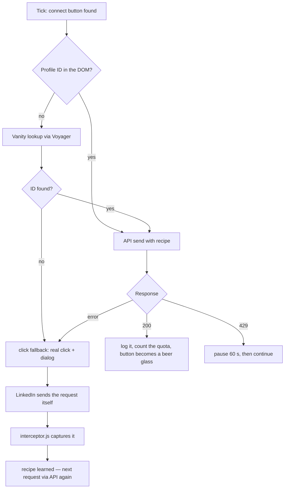
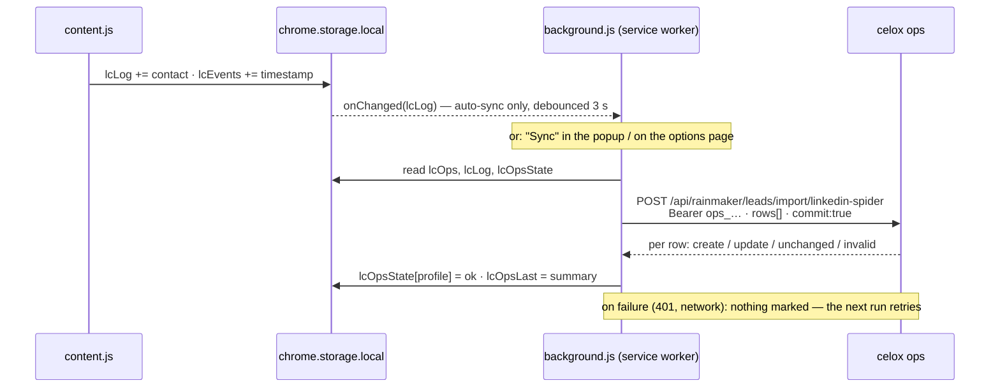

<p align="center">
  
</p>

<h1 align="center">LinkedIn Spider 🍻</h1>

<p align="center">
  <a href="README.md"></a>
  &nbsp;&nbsp;
  <a href="README_EN.md"></a>
</p>

<p align="center">
  
  
  
  
  
  
  
  
  
</p>

<p align="center">
  
  
  
  
  
  
  
  
  
  
  
</p>

<p align="center">
  
  
  
  
  
  
  
  
</p>

<p align="center">
  
  
  
  
  
  
  
  
  
  
  
</p>

<p align="center">
  <a href="https://www.paypal.com/donate/?business=martin.pfeffer@celox.io&currency_code=EUR&item_name=LinkedIn%20Spider"></a>
  &nbsp;
  <a href="https://g.page/r/CXgdRV3QysvxEBM/review"></a>
  &nbsp;
  <a href="https://celox.io"></a>
</p>


<p align="center">
  Chrome extension (Manifest V3) that sends connection requests on LinkedIn search result pages automatically — <b>with self-healing detection against LinkedIn's DOM and API changes</b>, a weekly quota, a contact log, exports and an integration with <a href="https://ops.celox.io">celox ops</a>.
</p>

## Contents

<!-- toc -->
- [At a glance](#at-a-glance)
- [How It Works](#how-it-works)
- [Features](#features)
- [Installation](#installation)
- [Usage](#usage)
- [Permissions and data](#permissions-and-data)
- [Architecture](#architecture)
- [Tests](#tests)
- [Development](#development)
- [Troubleshooting](#troubleshooting)
- [Changelog](#changelog)
- [Notes](#notes)
- [Legal](#legal)
- [Security](#security)
- [Developer](#developer)
- [License](#license)
<!-- /toc -->

## At a glance

1. **[Download the latest release](https://github.com/pepperonas/linkedin-spider/releases/latest)**, unzip, load it as an unpacked extension in `chrome://extensions` (developer mode).
2. Open a LinkedIn people search, click the extension icon, switch **Auto-Connect** on.
3. The badge in the bottom right shows progress — and always the weekly quota (`43/200 wk`).
4. Export contacts as **CSV** or push them straight into **celox ops** (popup ⚙ → token) — ops tells the extension whom **not** to ask again.
5. Rein in the pace on the options page: jitter, hourly/daily caps, stop at X % of the week (all optional).

> **Important after every update:** refresh the extension card in `chrome://extensions` **and** reload the open LinkedIn tab. Since 2.9.1 the extension tells you itself (`⚠️ Reload this page`) if you forget — before that it failed silently.

## How It Works

The extension scans LinkedIn search results for "Connect" buttons and sends connection requests directly through LinkedIn's Voyager API. If the API call fails (but not because of a rate limit), it falls back to clicking the real button — which also triggers LinkedIn's own request, from which the extension re-learns the current API shape.

**Technical details:**

- Direct API calls to LinkedIn's internal Voyager API (`verifyQuotaAndCreateV2`) with the CSRF token from the session cookie
- 1.5-second interval between requests (rate limiting)
- Automatic 60-second pause on HTTP 429 (LinkedIn rate limit)
- Profile detection via `componentkey` / `data-chameleon-result-urn` (URN-based); without a URN in the DOM via the card's `/in/<vanity>` link plus a Voyager lookup
- Language-independent detection of Connect buttons via `aria-label`, text or `href` (DE / EN / FR / IT / ES / NL / PT)
- The confirm dialog ("Send without a note/message") is handled automatically, in both wording variants

### Self-Healing

LinkedIn changes its DOM and API frequently. The extension resists this on two fronts:

1. **Heuristic DOM detection** — aria-label, text and `href` instead of fixed CSS classes. If one signal disappears, the others carry.
2. **A learning API interceptor** — `interceptor.js` runs in the page's MAIN world and captures LinkedIn's *own* invite request (URL, headers, body). That "recipe" is stored and replayed for every further request. If LinkedIn changes the endpoint or payload, **one** real click is enough and the extension is back on the fast API path.



The self-healing loop: the API path breaks → the click fallback kicks in → LinkedIn fires its own request → the interceptor captures it → from then on the fast API path works again automatically. A stale recipe is discarded on error and re-learned. The learned recipe is persisted in `chrome.storage`; the popup shows the API mode (`default` or `self-healed ✓`).

## Features

- **Self-healing** against DOM and API changes (see above)
- **Multilingual** — detection in DE / EN / FR / IT / ES / NL / PT
- ON/OFF toggle via popup, request counter (persistent), API mode indicator (`default` / `self-healed ✓`)
- **Weekly quota in the popup** — 200 free connection requests per week, used/remaining with a progress bar (plus the rolling 7-day figure); also shown on the in-page badge
- **Activity chart** with a selectable period (7 d / 30 d / 90 d / 1 year) — in the popup and in the HTML report
- **Contact log** — every sent request is stored permanently (name, date, profile URL, headline, company, location, connection degree, profile ID, send path, search term, search page)
- **The search term is recorded** — searching for "hausverwaltung Berlin" or "CTO Frankfurt" puts the segment **and** the city into the log and into the ops sync; the result card itself often does not name the location
- **Search picker in the overlay** — 69 delivered terms in three groups × your cities, one click opens the search; catalogue and cities are editable on the options page
- **A tally per term + city** — the extension keeps the count itself (Kaufmännischer Leiter · Berlin · 100), survives *Clear Log*, and shows in the picker, on the options page and in the HTML report
- **CSV export** — spreadsheet-ready (semicolon + UTF-8 BOM), file name with a date stamp
- **HTML report export** — a self-contained file with the chart, the quota and the contact table, no external assets
- **Backup & restore** — export and re-import every stored value as JSON; strict import
- **celox ops integration** — sent requests as Rainmaker leads (status "contacted"), via CSV import in ops or pushed from the extension (service worker, optionally automatic)
- **Back channel from ops** — lost, dormant and won leads, customers and stale contacts come back as a do-not-contact list; such cards are skipped on the search page
- **Pacing** (options page) — jitter instead of a fixed 1.5-s beat (on by default), optionally at most N per hour / per day and a stop at X % of the weekly allowance; the run pauses and resumes by itself
- **Cross-session duplicate guard** — anyone in the log is never asked again
- Visual status badge in the bottom right of the page, with a plain-language notice after an extension update
- Successful connections are marked with a 🍻 emoji — Material 3 Expressive physics animation (gravity drop, impact squash, decaying bounces) and a custom tooltip
- Automatic rate-limit detection with a 60 s pause; the click fallback detects the "Pending" state change as success
- **Version number + links in the popup footer** (SemVer)

## Installation

### Option 1: Download (recommended)

1. **[Download the latest release](https://github.com/pepperonas/linkedin-spider/releases/latest)** — ZIP file under "Assets"
2. Unzip — you get a folder `linkedin-spider`
3. Open Chrome and enter `chrome://extensions` in the address bar
4. Enable **Developer mode** (toggle top right)
5. Click **"Load unpacked"**
6. Select the unzipped `linkedin-spider` folder
7. The extension appears in the Chrome toolbar

### Option 2: Clone repository

```bash
git clone https://github.com/pepperonas/linkedin-spider.git
```

1. Open Chrome: `chrome://extensions`
2. Enable "Developer mode" (top right)
3. Click "Load unpacked"
4. Select the cloned folder

> **Note:** After every code update click the refresh icon on the extension card **and** reload the LinkedIn tab (F5) — otherwise the old content script keeps running with an invalid context (the extension then shows `⚠️ Reload this page`).

### Compatibility

| | |
|---|---|
| Browser | **Chrome 102** or newer (`minimum_chrome_version` in the manifest — older versions refuse to install instead of failing later on `optional_host_permissions`) |
| Other Chromium browsers (Edge, Brave, Vivaldi) | technically compatible, **not tested** |
| Firefox / Safari | not supported (MV3 service worker + `chrome.*` API) |
| LinkedIn language | DE, EN, FR, IT, ES, NL, PT |
| Distribution | GitHub release ZIP, **no** Chrome Web Store listing — sideloaded installs do not update themselves |

## Usage

<p align="center">
  
</p>

<p align="center">
  <em>The popup in use. At the top the weekly quota — 164 of 200 used, the bar turns amber past
  80&nbsp;%. Below it the activity chart (the running column is drawn lighter), the three figures,
  the exports, and the footer with the version and the links.</em>
</p>

1. Open LinkedIn people search (e.g. `https://www.linkedin.com/search/results/people/`)
2. Click the extension icon in the Chrome toolbar
3. Switch the toggle to ON
4. The badge in the bottom right shows progress in real time

**Weekly quota:**

LinkedIn allows **200 connection requests per week** for free. The top of the popup shows how many of those the current week has used, how many are left and when the allowance resets. The bar turns amber past 80 % and red once nothing is left.

- **Week = calendar week, starting Monday 00:00 local time.** Next to it sits the **rolling 7-day count** — LinkedIn throttles on a sliding window, so a Sunday-plus-Monday burst can trip it while the calendar week still looks harmless.
- The count comes from a separate list of timestamps (`lcEvents`), **not** from the contact log: that one is deduplicated, capped and user-clearable, so it would under-report. `Clear Log` therefore wipes the contacts, **not** the quota history.
- The in-page badge carries the figure permanently (`🕸️ ✅ #12 Name · 43/200 wk`) so the quota is visible exactly while requests are going out.
- On the first run after the update the history is seeded once from the timestamps already in the contact log.
- The extension does **not** stop itself at 200 — the display informs, the decision stays with the user.

> **Why "Requests sent" can exceed "Saved contacts":**
> the counter has been running since the first install, the contact log only since **2.8.0**.
> The quota and the chart are fed by the log, so they cannot reach further back than the day
> the log was created. In the screenshot above that is 1259 requests sent against 164 logged.

**Activity:**

Below the quota sits a bar chart of the requests sent. The period is picked with chips and is remembered (`chrome.storage`):

| Period | Resolution | Columns |
|--------|------------|---------|
| 7 d | day | 7 |
| 30 d | day | 30 |
| 90 d | week (Mon–Sun) | 13 |
| 1 y | month | 12 |

The running column is drawn lighter and marked "in progress" in its tooltip — otherwise the unfinished day reads as a slump. The chart is hand-written inline SVG: a Chrome popup runs under `script-src 'self'`, so a CDN chart library cannot load at all — and a bundled one would be the extension's only runtime dependency.

**Exporting contacts:**

Every successful request lands in the log (`Saved contacts` in the popup). **⬇ Export contacts as CSV** opens the save dialog with a suggested name like `linkedin-spider-anfragen-2026-08-30_1432.csv`.

| Column | Content |
|--------|---------|
| Datum | Time of the request, local time (`30.08.2026 14:32`) |
| Name | Name from the result card or the `aria-label` |
| Profil-URL | `https://www.linkedin.com/in/<vanity>` |
| Headline | Position line of the result card |
| Firma | Company link on the card, otherwise split off the headline (`… bei/at/@ …`) |
| Ort | Location line of the result card |
| Grad | Connection degree (`1.` / `2.` / `3.`) |
| Profil-ID | LinkedIn member URN ID |
| Methode | `api` (direct Voyager call) or `click` (fallback) |
| Suchbegriff | The text typed into LinkedIn's search box (`hausverwaltung Berlin`) |
| Suchseite | URL the request was triggered from |

The **search term** is read off the search page's address bar (`?keywords=…`) and stored verbatim — it is ops that interprets it (city → the lead's address, segment as context). That way there is exactly **one** mapping instead of two that can drift apart. Set the city through LinkedIn's location filter instead of the search box and it is, consistently, not part of the term. Older log entries do not carry the field yet, but they do carry the search URL it is derived from — so export and sync answer for them retroactively.

Card fields are best-effort: if LinkedIn changes its DOM, the affected column stays empty — sending is unaffected. The export reads `chrome.storage` directly, so it also works when the popup is opened over a non-LinkedIn tab. **Clear Log** wipes the log (two clicks) and thereby lifts the duplicate guard.

**Exporting a report (with the chart):**

**📊 Report** writes a self-contained HTML file (`linkedin-spider-report-2026-09-01_1432.html`): the weekly quota, the chart for the **currently selected** period and the full contact table. Everything is inline — no script, no CDN, no external font; the file opens offline from disk.

**Backup & restore:**

- **💾 Backup** writes every stored value as JSON (`linkedin-spider-backup-2026-09-01_1432.json`): contact log, quota history, counter, selected period and the learned API recipe.
- **↺ Restore** reads such a file back, in two steps: pick the file, then a second click confirms the overwrite.
- **The import is strict.** Foreign or damaged files are rejected **whole** (plain-language error in the popup) and nothing is written. App marker, type and schema version are checked; a newer schema is rejected rather than half-read. Unknown fields in contact records are dropped, broken counters/timestamps/periods are coerced to valid values.
- **Security:** session headers (`csrf-token`, `cookie`, `authorization`) are **stripped** from the recipe before it reaches the file — a backup you pass on carries no session token. Nothing is lost functionally: a fresh CSRF token is injected on every send anyway.
- **A restore never starts sending.** `Auto-Connect` is always OFF afterwards, whatever the file said.

**Pushing leads into celox ops (from 2.10.0):**

Every sent connection request can land in [celox ops](https://ops.celox.io) as a lead — a
`RainmakerLead` with status **"contacted"** and source `linkedin-spider`. ops recognises people who
are already in your pipeline by their profile URL and **only fills in what is missing** — nothing is
overwritten, nobody is moved backwards. A duplicate import is impossible on the database side.

Two paths, one mapping:

| Path | Where | When |
|------|-------|------|
| **CSV import** | ops → Pipeline → **"Spider-CSV"** | The export from above, with a preview (new / updated / already there) before anything is written. No token needed. |
| **Push from the extension** | popup row `ops: … pending` → **Sync**, or automatically after every send | Runs in the service worker, so it survives the popup closing. |



Setup for the push: in ops under **Einstellungen → "API-Token für LinkedIn Spider"** create a token
(shown exactly once), then in the popup click ⚙ → paste the token → **Test connection** → **Save**.
Optionally enable **"Sync automatically"**.

- In ops the token can **only import leads and read the do-not-contact list** — it cannot read, change
  or delete anything else. It is stored in this browser profile only and is never sent anywhere else.
- The sync state lives in its own storage key (`lcOpsState`), apart from the log: the worker never
  writes `lcLog` while the content script is appending to it.
- Failed pushes (network down, token revoked) stay pending and are retried on the next sync; the error
  is shown in the popup row. What ops rejects as invalid (no LinkedIn profile URL) is not retried forever.
- **What the extension cannot claim:** that a request was accepted. It only sees the send; `connected`
  is set by hand in ops.

**Back channel: ops says whom not to ask again (from 2.12.0):**

With every sync the service worker fetches the **do-not-contact list** from ops
(`GET …/import/linkedin-spider/blocklist`): the normalised profile keys of every lead closed as **lost,
dormant or won**, linked to a **customer**, or whose contact is marked as **no longer in the role**. Only
the keys travel (`linkedin.com/in/…`) — no names, companies or reasons.

- When a card on the search page hits the list it is **skipped**: no send, no log entry, no failure for the
  circuit breaker. The badge reads `⛔ ops: do not contact — Name`, the popup row counts `· N skipped`.
- The normalisation is the one ops uses (`norm_linkedin`: scheme, `www`/country subdomain, tracking
  parameters, case) and is pinned with **the same examples** — if the two drift, the list stops matching.
- A failed fetch keeps the last list (stale beats empty) and never turns a successful push into a failed
  sync. Options page → Status → **Refresh list** fetches it by hand; size and age are shown there too.
- A change takes effect **immediately**, even in a running tab (`chrome.storage.onChanged`).

**Picking and counting searches (from 2.14.0, the 🕸️ badge on LinkedIn):**

Clicking the badge opens the **picker**: cities on top, then a filter box and the catalogue in three
groups — **Direkte Kunden**, **Branchen / Unternehmen**, **Multiplikatoren** (69 terms out of the box).
Clicking a term opens the matching LinkedIn search (term + city, exactly as you would type it). Next to
each term stands **how many requests** that combination has already sent — this replaces the tally on
the notepad.

- The picker **only navigates**. It never arms the run; that stays the one deliberate switch in the popup.
- Entries are **real links** — middle-click opens a new tab, the keyboard reaches them, Enter in the
  filter box takes the first hit.
- Counting happens **on send**, into `lcStats`, and is not computed from the log: the log is capped at
  5000 and can be wiped with *Clear Log*, the tally survives both (same reasoning as `lcEvents` for the
  quota).
- A **hand-typed** search counts too, as long as its city is on your list. A search without a city lands
  honestly under "—" rather than under a guessed one.
- On the first start after the update the tally is **seeded once from the existing log**; after that only
  sends count. An empty tally is a state (your *Reset tally*) and is never re-seeded.
- For that the badge now also appears on the **feed** — that is where a cold start begins. On profiles
  and in messaging it stays away, as before.
- Editing the lists and the full table: **options page → Searches** (one term per line, *Restore
  defaults*, *Reset tally*). The HTML report carries the table along.

**Pacing (from 2.12.0, options page → Pacing):**

A run used to probe for the next card exactly every 1.5 s — a metronome you can recognise.

| Setting | Default | Effect |
|---|---|---|
| **Jitter** | on | The gap between two ticks is rolled anew each tick (0.9–2.1 s, ±40 %). Costs nothing, changes nothing about the volume. |
| **Max. per hour** | off (0) | Rolling 60-minute window over the timestamps (`lcEvents`) — so it also counts what went out before this run started. |
| **Max. per day** | off (0) | Local calendar day, resets at 00:00. |
| **Stop at % of the week** | off (0) | Relative to the weekly allowance (200). 80 means: at 160 it waits until Monday. |

A cap **pauses** the run, it does not stop it: badge `⏸ Pace: 20/hour reached · resumes 15:40`, popup
`Active · hourly cap · resumes 15:40`, the toggle stays on, and as soon as the window moves on the next
request goes out. An open confirm dialog is still handled during the pause. Changes apply without a
reload. Values outside the range (0–200 or 0–100) are clamped on save and shown as stored.

**Popup footer:**

The bottom of the popup carries the **version number** (SemVer, read straight from `manifest.json` — never hard-coded) plus links to [celox.io](https://celox.io), the [Google Maps review page](https://g.page/r/CXgdRV3QysvxEBM/review) and a PayPal donation to `martin.pfeffer@celox.io`.

**Status Badge:**
- "🕸️ ready" (grey) — Extension loaded, inactive
- "🕸️ Active (X sent)" (green) — Running, X requests sent
- "🕸️ ⏳ Name..." (LinkedIn blue) — Request being sent
- "🕸️ 🧬 Recipe learned" (purple) — API request successfully learned (self-healing)
- "🕸️ ✅ #X Name · 43/200 wk" (dark green) — Successful request; the suffix is the weekly standing
- "🕸️ ❌ Rate-Limit! 60s pause..." (red) — LinkedIn 429, waiting automatically
- "🕸️ ❌ No CSRF Token!" (red) — API error
- "🕸️ ⚠️ Reload this page" (red) — the extension was updated and this tab still runs the old content script. **Reload the page** and it continues
- "🕸️ ⏸ Pace: 20/hour reached · resumes 15:40" (amber) — a pacing cap holds the run; it resumes by itself
- "🕸️ ⛔ ops: do not contact — Name" (grey) — the card is on the do-not-contact list from ops and was skipped

## Permissions and data

### Permissions

The extension asks for exactly what it needs — and this table says what for:

| Permission | Used for |
|---|---|
| `activeTab` | The popup talks to the currently active LinkedIn tab (status polling, ON/OFF). |
| `storage` | Counter, log, quota history, learned recipe, ops settings — all in `chrome.storage.local`. |
| `downloads` | CSV, HTML report and backup are written through the downloads API with a save dialog and a suggested file name. |
| `https://ops.celox.io/*` (`host_permissions`) | The service worker may send leads to celox ops — this host only. |
| `https://*/*`, `http://localhost/*`, `http://127.0.0.1/*` (`optional_host_permissions`) | **Not** granted by default. Only requested when you save a **custom** ops address on the options page (Chrome then shows a prompt). `localhost` allows a development instance. |
| `*://*.linkedin.com/*` (content scripts) | `interceptor.js`, `lib.js` and `content.js` run on LinkedIn pages only. |

### What is stored

Everything lives in `chrome.storage.local` — in the Chrome profile on your machine, not in the cloud, not in `chrome.storage.sync`.

| Key | Content | Cleared by |
|---|---|---|
| `lcEnabled` | ON/OFF state of the toggle | — |
| `lcCount` | "Requests sent" counter (running since the first install) | Reset Counter |
| `lcLog` | Contact log (max. 5000 entries, FIFO), basis for the exports and the duplicate guard | Clear Log |
| `lcEvents` | Timestamp of every sent request (max. 400 days / 20,000), basis for the quota and the chart — **survives Clear Log**, otherwise the quota would lie | backup restore |
| `lcRecipe` | The learned invite recipe (self-healing) | discarded automatically on failure |
| `lcRange` | Selected chart period | — |
| `lcOps` | ops address, API token, auto-sync switch | options page |
| `lcOpsState` | Per contact: acknowledged by ops / invalid / error (kept apart from `lcLog` so the worker and the content script never write the same list) | "Forget sync state" |
| `lcOpsLast` | Summary of the last sync run | "Forget sync state" |
| `lcSeen` | Durable list of contacted profile IDs (max. 100,000, ~20 bytes each) — the duplicate guard beyond the log's FIFO cap; seeded once from the log on the first run after 2.11.0 | Clear Log |
| `lcHalt` | Reason and time when the circuit breaker (5 failures in a row) stopped the run | switching on again |
| `lcLastApiError` | LinkedIn's last rejection (status, first 300 characters of the reply) — for diagnosis on the options page | — |
| `lcUpdate` | Result of the last update check (only after your click, at most daily) | — |
| `lcPace` | Pacing settings: jitter, hourly/daily caps, stop at % of the week (default: jitter on, no caps) | options page |
| `lcTerms` | The search catalogue: three groups (direct clients, industries, multipliers), each a list of terms | options page |
| `lcCities` | The cities that are worked | options page |
| `lcStats` | Tally per "term + city" combination (max. 1000 combinations) — **survives Clear Log**, because it counts sends, not log rows | "Reset tally" on the options page |
| `lcCity` | The city last picked in the in-page picker | — |
| `lcBlock` | The do-not-contact list from ops: normalised profile keys (`linkedin.com/in/…`), count, fetch time — no names | replaced by the next sync |

### What leaves the browser

- **To LinkedIn:** the connection requests themselves (Voyager API) and the vanity lookup — nothing else.
- **To celox ops:** **only if you have stored a token.** Then the contact-log fields (name, profile URL, headline, company, location, degree, profile ID, send path, search term, search page, time) to the host in `lcOps.baseUrl` — and, the other way, the do-not-contact list (profile keys only). In ops the token authorises the import and reading that list, nothing else.
- **To nobody else.** No telemetry, no analytics, no update check, no external assets in the exports.
- The backup JSON strips session headers (`csrf-token`, `cookie`, `authorization`) from the stored recipe before writing the file.

## Architecture

Two content-script worlds, one service worker, two surfaces:

| File | World | Role |
|------|-------|------|
| `interceptor.js` | **MAIN** (`document_start`) | Patches `fetch`/`XMLHttpRequest`, captures LinkedIn's invite request, posts the "recipe" via `postMessage` |
| `lib.js` | ISOLATED | Pure, testable core functions: selectors, recipe building, invite detection, quota/chart maths, SVG chart, backup format, ops sync core, pacing maths, blocklist normalisation |
| `content.js` | ISOLATED | Orchestration: DOM scan, recipe-driven API calls, click fallback, recipe learning, badge, quota history, pacing, blocklist matching |
| `background.js` | service worker | ops sync: answers `opsSync`/`opsTest`/`opsBlocklist` messages and (with auto-sync) reacts to new log entries; fetches the do-not-contact list with every run; the logic itself is `lib.js::opsSyncRun`/`opsFetchBlocklist` with `fetch` injected |
| `popup.html` / `popup.js` | — | Popup UI: toggle, quota, chart, counter, API mode, ops row, CSV/HTML/backup export, restore, footer (loads `lib.js` too) |
| `options.html` / `options.js` / `options.css` | — | Options page: ops URL, API token, auto-sync, pacing, connection test, sync state, do-not-contact list, "Forget sync state", update check, diagnostics |
| `styles.css` | — | Popup styling |
| `manifest.json` | — | Chrome Extension Manifest V3 |
| `icon.png` | — | Extension icon |

`lib.js` is loaded by **every** surface (content script, popup, options page, service worker via `importScripts`) and is at the same time the unit-test target — the same file, not a replica.

### Message protocol

| Action | Direction | Payload | Response |
|---|---|---|---|
| `toggle` | popup → content script | `{ enabled }` | `{ ok }` |
| `getStatus` | popup → content script | — | `{ active, count, healed, contextGone, halted, paused, blocked }` |
| `resetCount` · `clearLog` · `reloadState` | popup → content script | — | `{ ok }` |
| `opsSync` | popup/options → **service worker** | — | `{ ok, summary, error }` |
| `opsTest` | options → **service worker** | `{ settings: { baseUrl, token } }` | `{ ok, status?, error? }` |
| `opsBlocklist` | options → **service worker** | — | `{ ok, count?, error? }` — fetches the do-not-contact list alone, no push |
| `invite-captured` | `interceptor.js` → content script (`window.postMessage`, own origin only) | `{ recipe }` | — |

If the tab does not answer (no content script, or after an extension update), the popup shows `⚠️ Reload the LinkedIn tab` instead of "Paused" and backs its polling off from 1 s to 5 s.

## Tests

```bash
npm install
npm test            # once
npx vitest          # watch mode
npx vitest run test/lib.test.js          # one file
npx vitest run -t "buildInviteRequest"    # one test
```

**571 unit and integration tests** with Vitest + jsdom (the timezone is pinned to `Europe/Berlin` in `vitest.config.js` — the quota and chart maths are calendar-local, and the bug naive millisecond arithmetic causes only exists where clocks actually shift):

| File | Checks |
|---|---|
| `test/lib.test.js` | core functions, self-healing helpers (recipe building, invite detection), multilingual detection |
| `test/interceptor.test.js` | **loads `interceptor.js` for real** in jsdom: a captured `fetch`/XHR invite is posted as a recipe, anything else is not, POST only, own origin only — plus a parity test of the heuristic against `lib.js` (the file carries its own copy because the MAIN world cannot see `window.LC`) |
| `test/export.test.js` | name cleaning, card scraping, CSV generation (quoting, injection guard, BOM), file name, log cap |
| `test/search-query.test.js` | the term from the search URL (encodings, fragment, non-search pages), fallback for older entries, CSV column, ops field, backup round trip |
| `test/searches.test.js` | catalogue and cities (normalising, dedupe, an emptied group stays empty), search URL incl. the round trip through `searchQueryFrom`, splitting into term + city (whole words, the list's spelling), counting, cap eviction, seeding from the log |
| `test/content-picker.test.js` | loads `content.js` for real: the picker opens from the badge, one link per term with the chosen city, the tally per combination, filtering, Esc/click-outside, never arms the run, counting on send, one-time seeding |
| `test/stats.test.js` | quota maths (calendar week, rolling 7 days, clamping), bucketing per period, DST nights, SVG chart (scaling, running column, escaping, empty state) |
| `test/backup.test.js` | backup format, secret stripping, strict import validation (foreign/damaged/too-new files) |
| `test/report.test.js` | HTML report: self-containment (no script, no external reference), escaping of scraped names, quota/period figures, empty state |
| `test/ops-sync.test.js` | the sync core (`opsSyncRun` with `fetch` injected): bearer token, batching, matching by response index, 401/network errors leave the state untouched, "invalid" is not retried forever |
| `test/content-log.test.js` | loads `content.js` for real and drives a full tick: a successful send lands in the log with its card data, a timestamp for the quota, the duplicate guard holds, backfill runs once |
| `test/resilience.test.js` | behaviour after an extension reload (badge notice, timer torn down, `getStatus` reports it) + a runtime cap on the backfill |
| `test/guard.test.js` | seen-list (`addSeen`/`seenIds`, cap), "pending" texts in 7 languages, `isSearchPage`, version comparison, release-payload validation, daily rhythm of the update check, `lcSeen` in the backup |
| `test/content-guard.test.js` | loads `content.js` for real: `lcSeen` is written/read/seeded once and cleared with Clear Log, click success in ES/IT/FR/PT/NL, circuit breaker after 5 failures (not the whole page), a success resets the streak, badge only on search pages or during a run |
| `test/background.test.js` | loads `background.js` for real: sync on message, debounced auto-sync, never two runs at once, `lcLog` is never touched, do-not-contact list with every run (a failure keeps the old one), `opsBlocklist` alone |
| `test/popup-export.test.js` | loads `popup.html` + `popup.js` for real: export download, cancel behaviour, two-step clear |
| `test/popup-stats.test.js` | loads `popup.html` + `popup.js` for real: quota display, chart + period selection, HTML report, backup/restore round-trip, unreachable tab, ops row (incl. do-not-contact list + skipped cards), pacing pause in the status, footer links |
| `test/options.test.js` | loads `options.html` + `options.js` for real: validation, host permission, connection test, sync state, two-step forget, pacing form (clamping, shows what was stored), do-not-contact list state + refresh |
| `test/styles.test.js` | contrast floors (4.5:1 / 3:1) for the popup, the options page **and** the report stylesheet, button-row layout contract, every id `popup.js` reaches for exists in the markup |
| `test/docs.test.js` | documentation guards: table of contents ↔ headings, DE/EN parity (sections, diagrams, images, badge count), every storage key and every permission documented, minimum Chrome version, no dead links, badges checked against constants |
| `test/version.test.js` | SemVer, parity between `manifest.json`, `package.json` and the README badge, footer contract, documentation integrity (image references, alt text, test list) |
| `test/release.test.js` | checks the release ZIP contains **every** manifest entry point — content scripts, popup, service worker including `importScripts`, options page including its assets |
| `test/pace.test.js` | pacing maths: defaults, clamping, jitter range (±40 %), hourly/daily/weekly caps with resume time, order of reasons |
| `test/content-pace.test.js` | loads `content.js` for real: rolled beat (anew each tick), fixed beat without jitter, caps pause instead of halting, the run's own sends count, changes apply live, a dialog is still handled while paused, `stop()` clears the timer |
| `test/blocklist.test.js` | normalisation **at parity with ops `norm_linkedin`** (the same examples), matching, fetch with bearer token, errors/foreign payload write nothing, the scan skips marked cards |
| `test/content-block.test.js` | loads `content.js` for real: a blocked card is skipped (no send, no log entry, no failure), also without a profile id (the mark on the element), the list applies live, ops normalisation on the card |

### Testing conventions

- **Load the real files, do not re-implement them.** `content.js`, `background.js`, `interceptor.js`, `popup.html`+`popup.js`, `options.html`+`options.js` are executed in jsdom (Chrome API and `fetch` stubbed, timers faked). A test that merely imitates the logic can stay green while the shipped file is broken.
- **Every new assertion is mutated once.** A test you have not watched fail is not a guarantee. Several guards in this repo were green-blind on the first attempt — the probes showed it, the tests were tightened.
- **Pure logic lives in `lib.js`** (`window.LC` + `module.exports`), so the same file is the unit-test target. The ops sync core takes `fetch` as a parameter — the same code runs in the service worker, in jsdom, and in Node against a real ops.

## Development

No build step. Changes to `.js` files: refresh the extension card in `chrome://extensions`, reload the LinkedIn tab. All logs in the tab's DevTools console carry the prefix `[LC]` (content script), `[LC-MAIN]` (interceptor), `[LC-bg]` (service worker, console under `chrome://extensions` → "Service Worker").

**Where things go:** logic you want to test → `lib.js`. State and orchestration → `content.js`. Anything that leaves the browser → `background.js`. Popup styles → `styles.css` (not injected into LinkedIn; the 🍻 marker's styles live in `content.js`).

### Release

```bash
git tag vX.Y.Z && git push --tags
```

triggers `.github/workflows/release.yml`: tests → ZIP → GitHub Release. The package list is one `cp` line; `test/release.test.js` pins that it covers every manifest entry point — after exactly the mistake that shipped 2.7.0–2.7.4 without `interceptor.js`. Version number in `manifest.json` **and** `package.json` (a test pins parity), badge and changelog entry in **both** READMEs (a test pins that too).

## Troubleshooting

| Symptom | Cause | Fix |
|---|---|---|
| Badge `⚠️ Reload this page`, popup `⚠️ Reload the LinkedIn tab` | The extension was updated, the tab still runs the old content script | Reload the LinkedIn tab (F5) |
| Popup shows "Paused", nothing happens | The active tab is not a LinkedIn page | Switch to a LinkedIn tab, reopen the popup |
| Badge `✅ Active - no buttons` | No unprocessed "Connect" buttons on the page — all sent, skipped (already in the log) or LinkedIn shows "Follow" instead of "Connect" | Scroll on / next page |
| Badge `❌ Rate-Limit! 60s pause...` | LinkedIn answered HTTP 429 | Do nothing — it resumes after 60 s |
| Badge `❌ No CSRF Token!` | No `JSESSIONID` cookie — not logged in or cookies blocked | Log in to LinkedIn |
| Badge `⚠️ Stopped: 5 failures in a row`, popup "Stopped" | Five cards in a row rejected by LinkedIn — usually the weekly limit; the reply is under options page → Diagnostics | Wait (quota), then switch on again |
| No 🕸️ badge visible | You are not on a search result page and no run is active | Intended — it appears on a `/search/results/…` page |
| Popup footer shows `→ x.y.z ↗` | A newer version is published on GitHub (update check on the options page) | Open the link, download the ZIP, reload the extension |
| Contacts are skipped although never asked | The profiles are in the log (`lcLog`) — duplicate guard | Intended. If needed, **Clear Log** (lifts the guard for everyone) |
| "Requests sent" much larger than "Saved contacts" | The counter runs since the first install, the log only since 2.8.0 | Not a bug; chart and quota only reach back to when the log was created |
| Chart shows a single column | The history is younger than the selected period | Pick a shorter period or wait |
| Popup row `ops: ops answered 401: …` | Token revoked, rotated or mistyped | Create a new token in ops, enter it on the options page, **Test connection** |
| `ops: ops unreachable: …` | No network or ops down | Try again later — pending contacts stay pending |
| Options page: "Chrome did not grant access to …" | Custom ops address, permission prompt declined | **Save** again, accept the prompt |
| Import in ops reports "invalid" | Row without a LinkedIn profile URL (`linkedin.com/in/…`) | Not retried — intended |
| CSV opens in Excel as a single column | Excel's locale ignores the semicolon | Import via "Data → From Text" with delimiter `;` |
| Update does not arrive | Old extension version cached | `chrome://extensions` → Update, reload the tab; check the version in the popup footer |

## Changelog

### 2.14.0 — Search picker and a tally per term + city

- ✨ **Picker in the overlay** (click the 🕸️ badge): 69 delivered terms in three groups × your cities,
  a filter box, one click opens the LinkedIn search. Entries are real links — middle-click, keyboard and
  Enter in the filter therefore work by themselves
- ✨ **A tally per combination** (`lcStats`): next to every term stands how many requests "term + city"
  has already sent. Counted **on send**, not computed from the log — that is capped and can be wiped
  with *Clear Log*, the tally survives both
- ✨ **Options page → Searches**: edit catalogue and cities (one term per line, *Restore defaults*),
  the full table with a filter, *Reset tally*. The HTML report carries the table, so does the backup
- 🧠 On the first start the tally is **seeded once from the existing log** — which reproduces a
  hand-kept count exactly. An empty tally is a state and is never re-seeded
- 🧠 The picker **never** arms the run; a hand-typed search still counts, and a search without a city
  lands under "—" instead of under a guessed one
- ⚠️ The badge now also appears on the **feed** (a cold start begins there, and it is the way into the
  picker); on profiles and in messaging it stays away
- 🧪 2 new suites (`searches`, `content-picker`), 44 new tests, every assertion mutated once — one probe
  found a real bug in the eviction at the combination cap

### 2.13.0 — The search term in the log

- ✨ **The search term is recorded.** Searching for "hausverwaltung Berlin" or "CTO Frankfurt" puts the segment **and** the city on the contact — the result card often does not name the location, and where LinkedIn has none the headline slides into the location line (measured in ops: 39 leads with a job title as their address). It reads `?keywords=…` off the search page and stores it **verbatim** — interpreting it (city, segment) happens in ops, so it stays one mapping instead of two
- ✨ New CSV column **Suchbegriff** (before "Suchseite"), new ops field `search_query`; included in the backup
- 🧠 **Retroactive without a migration:** older entries do not carry the field, but they do carry the search URL it is derived from — so export and sync answer for them. To enrich leads already pushed to ops, reset **Forget sync state** on the options page; ops is idempotent and only fills what is empty
- 🧪 New suite `test/search-query.test.js` (20), 7 mutation probes; the column-count assertion now counts against the column list instead of a hard-coded 10

### 2.12.0 — Pacing and the back channel from ops

- ✨ **Pacing** (options page → Pacing): **jitter** instead of a fixed 1.5-s beat (on by default, 0.9–2.1 s), optionally **max. N per hour** (rolling 60 min), **max. N per day** (calendar day) and **stop at X % of the week**. A cap pauses the run and lets it resume by itself; badge and popup name the reason and the resume time. Settings apply without a reload. Ticks are chained `setTimeout`s now instead of a `setInterval`
- ✨ **Back channel from celox ops:** with every sync the service worker fetches the **do-not-contact list** (`GET …/import/linkedin-spider/blocklist`, ops 1.3.0+) — lost/dormant/won leads, customers, stale contacts, as normalised profile keys only. Cards on the list are skipped: no send, no log entry, no failure for the circuit breaker. Normalisation at parity with ops and pinned with the same examples; a failed fetch keeps the old list. The options page shows size/age and has **Refresh list**
- ✨ Popup: pacing pause in the status (`Active · hourly cap · resumes 15:40`), skipped cards in the ops row, list state in the tooltip; `getStatus` carries `paused` and `blocked`
- 🧹 The two simulation suites (content / popup, from 2.6) are gone — they tested their own stand-ins, not the shipped files; everything in them is covered by the real-load suites
- 🧪 4 new suites (`pace`, `content-pace`, `blocklist`, `content-block`), every new assertion mutated once — one probe found that the block mark on the element only matters for cards **without** a profile id (with an id the seen-list would have kept the test green)
- 📦 The backup carries `lcPace`; an older backup restores the defaults

### 2.11.0 — Durable duplicate guard, circuit breaker, update notice

- **The duplicate guard no longer forgets**: it used to be fed from the log alone, which rotates at 5,000 rows — at 200 requests a week people became askable again after ~25 weeks. New `lcSeen`, a bare ID list (100,000 entries ≈ 2 MB), seeded once from the log on first start; Clear Log clears it too (the documented "lifts the guard" contract stands)
- **Circuit breaker**: five rejected cards in a row (API **and** click) halt the run — before, it crawled through the whole page at 3 × 6 s per card once LinkedIn's weekly limit was hit. LinkedIn's exact reply is not known; the guard keys on the symptom, not on a guessed message. The last rejection is kept for diagnosis under options page → Diagnostics
- **"Pending" detection in all seven languages** (only DE/EN before — on ES/IT/FR/PT/NL a successful click without a dialog counted as a failure)
- **Badge only on search result pages or during a run** — no more 🕸️ in the feed, on profiles, in messaging; follows in-app navigation
- **Update notice, opt-in**: "Check for updates" on the options page asks Chrome once for access to `api.github.com` (never on install, never silently), then at most daily; the popup footer shows a newer version as a link. Sideloaded installs finally learn about new versions — missing since 2.7.0–2.7.4
- Two hints at zero height cost: "since 1.9." next to the chart when the history is younger than the period; tooltips explain "Requests sent" (since install) vs. "Saved contacts" (since 2.8.0)
- Popup still under Chrome's 600px cap (worst case measured 597px); halt and chart lines are single-line, full text in the tooltip
- Suite 392 → 439; 15 mutation probes, all caught

### 2.10.1 — Documentation, tests, manifest hardening

- **README restructured** (DE + EN mirrored): table of contents, "At a glance", compatibility with a minimum Chrome version, **Permissions and data** (every permission explained, every storage key documented, what leaves the browser), message protocol, troubleshooting, legal (LinkedIn User Agreement), two Mermaid diagrams (self-healing loop, ops sync sequence), 44 badges — only ones whose claim is true (no store badge, no coverage badge)
- **`minimum_chrome_version: 102`** in the manifest — `optional_host_permissions` only exists from Chrome 102; older versions now refuse to install instead of failing silently later
- **`interceptor.js` has tests for the first time** (20): the file is loaded for real in jsdom — a captured `fetch`/XHR invite is posted as a recipe, anything else is not, POST only, own origin only — plus a parity test of the invite heuristic against `lib.js` (the MAIN-world copy could drift unnoticed until now)
- **Documentation guards** (`test/docs.test.js`, 22): table of contents ↔ headings, DE/EN parity, every `lc*` storage key and every manifest permission documented, minimum Chrome version, no dead links, badges checked against constants
- The contrast guard now also covers the options page and the ops row (the WCAG AA badge holds for every surface)
- GitHub Actions on `checkout@v5` / `setup-node@v5` (Node 20 deprecation)
- Suite 346 → 392

### 2.10.0 — celox ops integration

- **Leads into ops**: every sent request as a `RainmakerLead` with status "contacted" and source `linkedin-spider`. ops deduplicates on the normalised profile URL (unique index per workspace) and, on a match, fills only empty fields — never overwrites, never moves a lead backwards
- **Two paths, one mapping**: CSV import in ops (Pipeline → "Spider-CSV", with preview) and a push from the extension. The push runs in a new **service worker** (`background.js`) — it survives the popup closing and can deliver automatically after every send (debounced, never two runs in parallel)
- **Options page** (`options.html`) for ops URL, API token, auto-sync and a connection test; the popup shows a single row (`ops: 3 pending · Sync · ⚙`) — it had 4px to spare under Chrome's 600px cap
- The sync state lives in `lcOpsState`, **apart from `lcLog`** — worker and content script never write the same list
- `host_permissions` for `https://ops.celox.io`; a custom ops host is requested via `optional_host_permissions` on save
- ⚠️ **The release guard had a blind spot**: it only knew content scripts and the popup, not `background.service_worker`, `options_ui.page` or `importScripts()` — exactly the kind of gap that shipped 2.7.0–2.7.4 without `interceptor.js`. It now checks every manifest entry point
- Suite 287 → 346; 19 mutation probes, all caught (one only after tightening: matching by response index vs. position was indistinguishable with ordered fixtures)

### 2.9.1 — No longer silent after an update

After the extension is updated, an already-open LinkedIn tab keeps running the
**old** content script — but its link to the extension is gone, so every
`chrome.*` call throws `Extension context invalidated`. Until now the run died
**silently**: no requests, no log entries, an unchanged badge, and a popup that
could not reach the tab yet still showed "Paused". Reloading the page is the
only cure, so that is what it says now.

- **Page badge**: `⚠️ Reload this page` (red) instead of a frozen state. The
  notice is no longer painted over — a later success message would cover the one
  line explaining why nothing is being recorded any more
- The scan timer is torn down instead of firing into the void
- `getStatus` reports `contextGone` so the popup knows
- **Popup**: the status line says `⚠️ Reload the LinkedIn tab` (measured 6.26:1),
  backs its polling off from 1 s to 5 s rather than hammering a silent tab, and
  recovers by itself once the tab answers again. Quota, chart and every export
  keep working throughout — they come from storage, not from the tab
- The toggle no longer implies it started something nobody received
- **Backfill de-quadratified**: the one-off import of history from the contact
  log re-sorted the series on **every** record — measured 619 ms for 5000
  entries, growing as n², synchronously on every page load. Now one pass and one
  sort, with a test capping the runtime
- Suite 263 → 283 tests; 13 new mutation probes, all caught. Two survived at
  first and revealed that the assertions held with or without the fix — since
  tightened. One of those found a real bug in the fix itself: the success
  message was overwriting the warning

### 2.9.0 — Quota, activity, backup

- **Weekly quota in the popup**: 200 free requests per week, used + remaining with a progress bar, reset date, warning colour past 80 % and at 0. Plus the **rolling 7-day count**, because LinkedIn throttles on a sliding window
- The figure also rides on the **in-page badge** — visible exactly while requests are going out
- Counting uses **its own timestamp series** rather than the contact log (that one is deduplicated, capped and clearable, so it would under-report); on the first run after the update it is seeded once from the existing log
- **Activity chart** with a selectable period (7 d / 30 d / 90 d / 1 year), the choice is remembered; hand-written inline SVG with no dependency (a popup runs under `script-src 'self'`). The running column is marked "in progress". It is only redrawn on a real change — the one-second poll would otherwise tear off live tooltips
- **HTML report export**: a self-contained file with the chart, the quota and the contact table, fully inline
- **Backup & restore** of every stored value as JSON. The import is strict (app marker, type, schema; foreign/damaged files are rejected whole without writing anything), session headers are stripped from the recipe before writing, and a restore always leaves `Auto-Connect` OFF
- **SemVer + footer** in the popup: version from the manifest, links to celox.io, the Google Maps review page and a PayPal donation
- `manifest.json` and `package.json` now carry the same version — a test pins it (they had drifted apart across five releases)
- **Popup compacted**: Chrome caps popups at 600px tall and the new blocks pushed the footer below that. The three figures now sit side by side and Report/Backup/Restore share a row. Measured 596–598px depending on state (the hint line is empty or filled); the screenshot above shows 597px
- **Contrast fixed**: the muted tone introduced here measured 3.19:1, below the 4.5:1 floor; every text role now measures 5.0–5.7:1. A test pins the floor — for the popup **and** for the report stylesheet
- Test suite from 136 to 263 tests, every new assertion mutation-probed

### 2.8.0 — Contact log & CSV export

- Every successfully sent request is logged to `chrome.storage.local` (name, timestamp, profile URL, headline, company, location, connection degree, profile ID, send path, search page)
- **CSV export in the popup**: semicolon-separated with a UTF-8 BOM (German Excel opens it straight into columns), file name with a date stamp pre-filled in the save dialog
- Guard against CSV formula injection — scraped names end up in a spreadsheet
- **Cross-session duplicate guard**: already-contacted profiles are not asked again after a reload
- New `downloads` permission
- **Release ZIP fixed**: `interceptor.js` had been missing from the packaging since 2.7.0 even though the manifest declares it as a content script — the ZIPs of releases 2.7.0–2.7.4 are therefore incomplete. A test now pins that the ZIP contains every file the manifest references
- Test suite grown from 67 to 136 tests, every new assertion mutation-tested

### 2.7.4 — Vanity lookup: API path without the overlay
- ✨ **NEW:** Cards without a profile URN in the DOM are now resolved via the card's profile link (`/in/<vanity>`) + a Voyager lookup (`getVanityFromCard` + `resolveProfileIdByVanity`) — these cards take the direct API path too. The click fallback (and thus the invite overlay, which doesn't even open on some pages) is only needed as a last resort
- 🛡️ Ambiguity guard: if the container holds links to *different* profiles (= the whole result list), the lookup aborts instead of inviting the wrong person; resolved IDs are cached and checked against duplicate invitations
- ✅ Test coverage raised from 63 to 67

### 2.7.3 — Pointer events & anti-wedge
- 🛠️ **FIX:** `realClick()` now dispatches a full pointer+mouse sequence (`pointerdown`/`pointerup` + coordinates) — LinkedIn's new SDUI (React) buttons only respond to pointer events, so plain MouseEvents were silently ignored (the click fallback did "nothing")
- 🛠️ **FIX:** Cards without a profile ID whose click fallback keeps failing are skipped after 3 attempts (`data-lc-fails`) — previously a single broken card wedged the whole run forever
- 🛠️ **FIX:** The confirm click is now verified (dialog actually closed?) and retried up to 3×; if the dialog still hangs, it is dismissed after 5 ticks instead of stalling the run
- ⏱️ Post-click dialog wait window raised from 3 s to 6 s (sluggish search pages)
- ✅ Test coverage raised from 60 to 63

### 2.7.2 — Confirm-dialog fix
- 🛠️ **FIX:** LinkedIn changed the dialog wording ("Send without a **message**" instead of "Send without a **note**") — detection now matches both variants via anchored regexes in all 7 languages, so the sibling button ("Send with a message") can never match
- 🛠️ **FIX:** SDUI dialogs without `role="dialog"`/`.artdeco-modal` are found via a document-wide fallback scan
- ✅ Test coverage raised from 56 to 60

### 2.7.1 — 🍻 Material 3 Expressive
- ✨ **NEW:** Animated 🍻 success emoji in Material 3 Expressive style — spatial spring with a gravity drop, impact squash & stretch, decaying bounces (overshoot/settle) and an amber shockwave ring
- ✨ **NEW:** Custom tooltip on hover ("🍻 Networking, bottled and served by LinkedIn Spider") with a spring entrance, viewport clamping and auto-flip; `position: fixed` to escape LinkedIn's overflow clipping
- ♿ Full `prefers-reduced-motion` guard + `role="img"`/`aria-label`

### 2.7.0 — Self-Healing
- 🧬 **NEW:** API auto-capture via a MAIN-world interceptor — learns LinkedIn's current invite endpoint by itself
- 🛠️ **FIX:** Connect buttons were no longer found after LinkedIn's SDUI migration (nested `<span>` hashes, `data-view-name` gone) → detection now via `aria-label` / text / `href`
- 🌐 **NEW:** Multilingual detection (DE/EN/FR/IT/ES/NL/PT) for connect buttons and the confirm dialog
- 🛠️ **FIX:** More robust profile ID extraction — matches any `urn:li:fsd_profile:` ID, not just two fixed attributes
- ✨ Popup shows the API mode (`default` / `self-healed ✓`)
- ✅ Test coverage raised from 40 to 56

### 2.6.0
- English language support, badge messages in English

## Notes

- Works only on `*.linkedin.com` pages
- `interceptor.js` runs in the MAIN world at `document_start`, `lib.js`/`content.js` in the ISOLATED world at `document_idle`
- The ON/OFF state survives a reload of the LinkedIn page
- Processed profiles are tracked in an in-memory set (survives LinkedIn's DOM replacement) and seeded from the log (survives reloads)
- Modals are skipped automatically (no sending for buttons inside dialogs)
- The extension does **not** stop itself at the weekly quota — the display informs, the decision stays with the user. It does stop after **five rejected cards in a row** (API and click) instead of crawling through the page at 18 s per card — usually LinkedIn's weekly limit. Switching on starts afresh
- The badge only appears on search result pages or while a run is active — invisible in the feed, on profiles, in messaging
- What the extension cannot know: whether a request was **accepted**. It only sees the send

## Legal

Automated sending of connection requests violates LinkedIn's User Agreement ("Dos and Don'ts"). LinkedIn may restrict or suspend accounts. This project is a technical tool with no affiliation to LinkedIn; you use it **at your own risk and on your own responsibility**. The authors accept no liability for account restrictions or any other consequences. Anyone using the extension should respect the weekly quota and not flood recipients with requests.

## Security

- The CSRF token is extracted from the session cookie and injected fresh on every request (a captured one may have expired). API calls use `credentials: 'include'` and send the `csrf-token` header per the LinkedIn Voyager protocol.
- Learned recipes stay local in `chrome.storage`. The backup JSON strips session headers from the recipe before writing it.
- The ops API token lives in the browser profile (`chrome.storage.local`), is sent only to the configured ops host and **never** to the LinkedIn tab (a test pins that). In ops it authorises the lead import and nothing else; revoking or rotating it in ops makes it worthless at once.
- CSV cells are guarded against formula injection (leading `= + - @` get an apostrophe) — these are scraped names heading into a spreadsheet. The ops import takes exactly that apostrophe off again.
- The HTML report escapes every scraped string and loads no external resources.
- No telemetry, no update check, no connection to third parties other than LinkedIn and — only with a stored token — ops.

## Developer

**Martin Pfeffer** — [celox.io](https://celox.io)

## License

MIT — see [LICENSE](LICENSE)
